# Lanaguage Model(LM) Using transformer encoder/decoder

## Introduction
- Transformer의 Encoder stack을 사용한 BERT 모델 학습 연구 보고서

## Preliminaries
- Transformer

  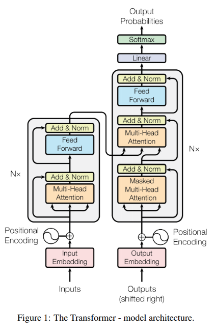

  * Input Embedding
  * Positional encoding
  * encoder
    * multi head attention
    * feed forward
    * add & layernorm
    * residual connection
  * decoder
    * masked multi head attention
    * multi head attention
    * feed forward
    * add & layernorm
    * residual connection

## Methods
### dataset
  * AI Hub - 한국어-영어 번역(병렬) 말뭉치
    - AI 번역 엔진 개발을 위한 총 160만문장의 학습용 문장을 구축한 자연어 데이터를 제공한다.  
    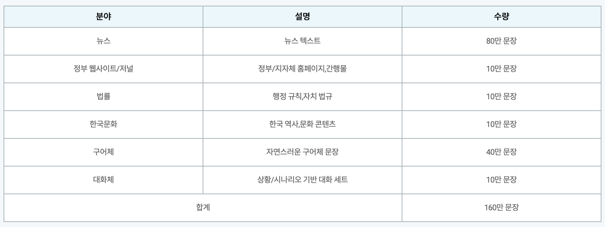
    - 데이터 예시  
    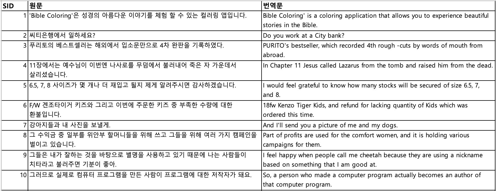

  * kaggle - tweet disaster dataset
    - 일반 트윗 메시지와 재난 관련 트윗 메시지가 혼합되어 트윗 메시지가 재난/재해와 연관이 있는지 구분하는 데이터셋이다.
    - 총 7613개의 학습용 문장/라벨 제공한다.
    - 데이터 예시  
  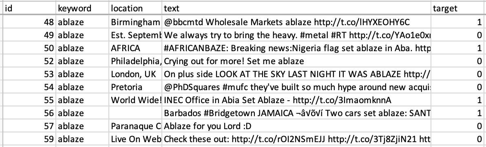

  * Pile
    - 언어 모델 학습을 위한 800GB 이상의 대규모 학습 데이터세트로 구성된 영어 오픈 소스 데이터 세트이다.
    - github, ArXiv, wikipedia, youtube 자막 등 총 22개의 하위 데이터세트로 구성되어있다.  
  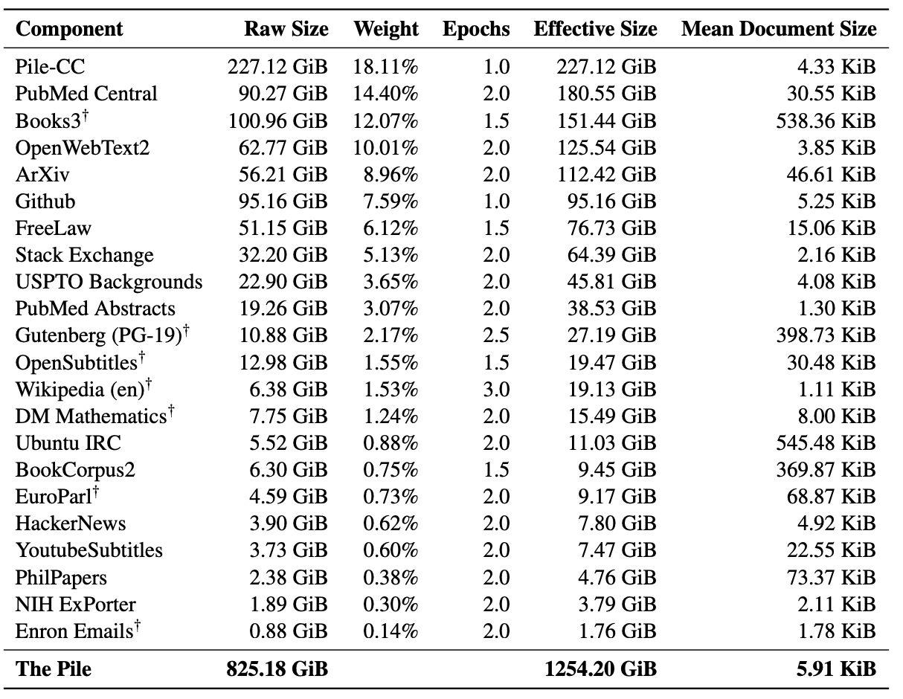

### tokenization
  * BPE (Byte pair encoding)
    - 데이터에서 가장 많이 등장한 문자열을 병합해서 데이터를 압축하는 기법이다.  
  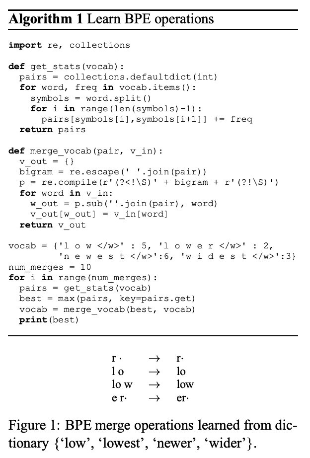
    - 생성된 BPE 사전

      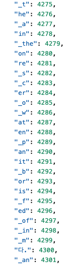
    
### models
  #### pre training - BERT
  
  

  - 입력 token 중 15% token을 예측. 15%의 token을 아래 비율대로 처리한다.
    - 80%: [MASK] token으로 변경
    - 10%: 임의의 token으로 변경
    - 10%: 변경하지 않고 그대로 둠
  - static masking -> dynamic masking (RoBERTa)  
  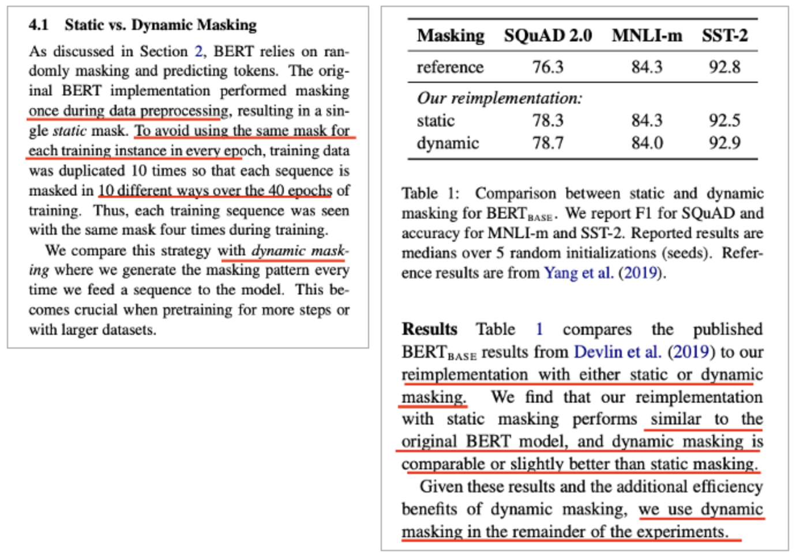
    - RoBERTa의 경우 고정된 mask token이 아닌 10가지 masking을 각각 4번 반복하여 학습한다.(40 epochs)
      - BERT의 static masking보다 뛰어난 성능을 보인다.
    - RoBERTa의 방식에서 더 나아가 매 epoch마다 random하게 새로 masking하는 방식을 사용한다.
  - 연속된 문장이 없는 데이터셋 특성을 고려하여 [CLS], [SEP] 토큰 제거하고 단일 문장을 학습에 사용했다.
  - token output에서 linear regression을 사용하지 않고 embedding을 사용한다.
    - linear를 사용하지 않으므로 학습에 필요한 parameter수가 줄어들고 성능은 좋아진다.

  #### fine tuning - cnn sentence classification
- Convolutional Neural Networks for Sentence Classification  
  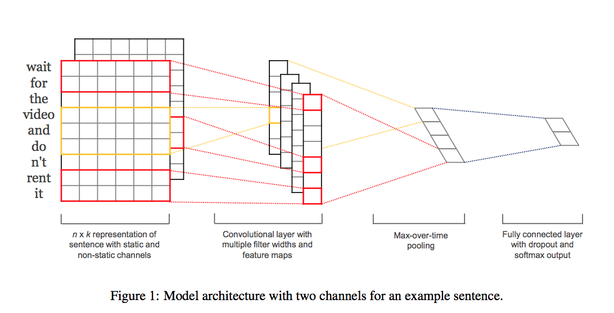
- BERT + CNN classifier

  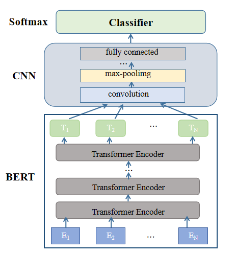

  - pre train한 모델의 top layer에 cnn classification layer를 사용한다.

## Experiments
### AI Hub dataset
#### pretraining
* Trial 1.
  - 
  - 영어, 한글이 포함된 데이터셋을 사용

  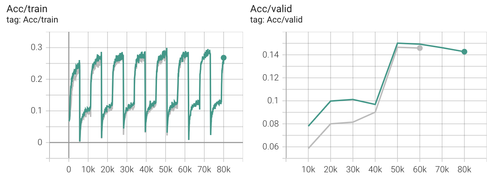

  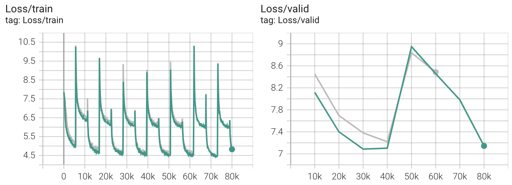

  - 한글, 영어 언어적 특성 차이에 따른 성능 차이가 발생했다.
    - 영어 dataset이 훨씬 좋은 score를 내는 것을 확인
  - 언어간 학습 편차를 없애기 위해 이후 영어 데이터셋만 사용

* Trial 2.
  - 
  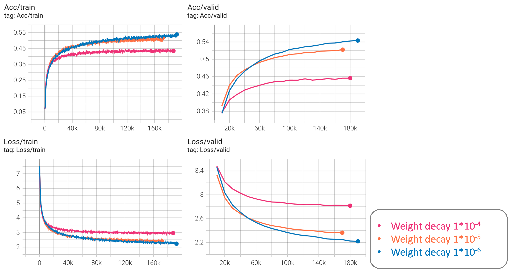
|batch|lr|weight decay|d_model|h|ff|layers|dropout|epoch|train/acc|valid/acc|
|:---:|:---:|:---:|:---:|:---:|:---:|:---:|:---:|:---:|:---:|:---:|
|256|$5*10^{-4}$|$1*10^{-5}$|512|8|2048|3|0.1|32|0.44|0.45|
|256|$5*10^{-5}$|$1*10^{-5}$|512|8|2048|3|0.1|32|0.51|0.52|
|256|$5*10^{-6}$|$1*10^{-5}$|512|8|2048|3|0.1|32|0.53|0.54|
  - weight decay $5*10^{-6}$가 가장 좋은 성능을 보였다.

* Trial 3.
  -
  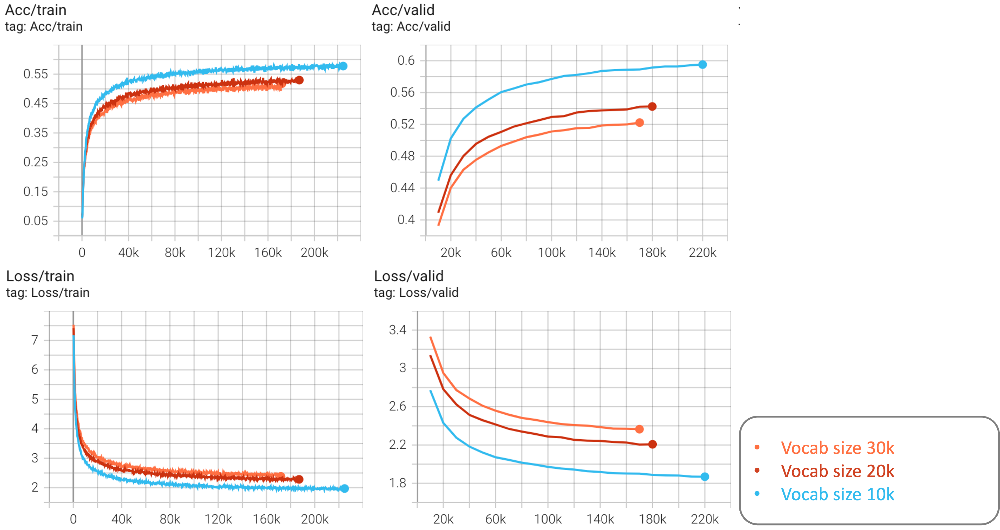
|vocab size|batch|lr|weight decay|d_model|h|ff|layers|dropout|epoch|train/acc|valid/acc|
|:---:|:---:|:---:|:---:|:---:|:---:|:---:|:---:|:---:|:---:|:---:|:---:|
|10k|256|$5*10^{-5}$|$1*10^{-5}$|512|8|2048|3|0.1|31|0.57|0.59|
|20k|256|$5*10^{-5}$|$1*10^{-5}$|512|8|2048|3|0.1|31|0.53|0.54|
|30k|256|$5*10^{-5}$|$1*10^{-5}$|512|8|2048|3|0.1|31|0.51|0.52|
  - vocab size가 적을 수록 높은 score 달성했다.
    - 그렇다면 극단적으로 줄여서 단어가 아닌 문자만으로 vocab을 구성하면 더 좋은 결과가 나올지 의문이다.
      - vocab size가 작아질수록 학습 문장 구성 token의 갯수가 많아지는 부분은 존재한다.

* Trial 4.
  -
  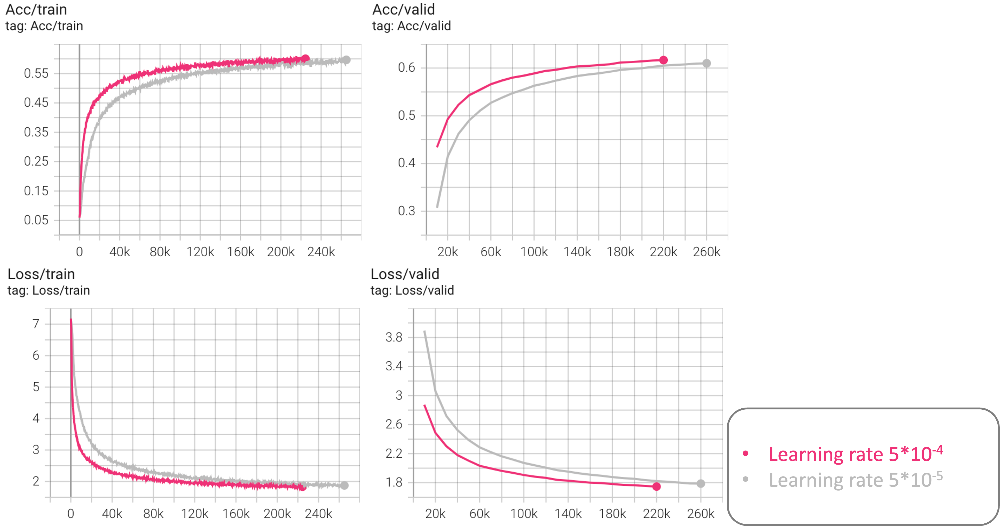
|vocab size|batch|lr|weight decay|d_model|h|ff|layers|dropout|epoch|train/acc|valid/acc|
|:---:|:---:|:---:|:---:|:---:|:---:|:---:|:---:|:---:|:---:|:---:|:---:|
|10k|256|$5*10^{-4}$|$1*10^{-6}$|512|8|2048|3|0.1|39|0.60|0.62|
|10k|256|$5*10^{-5}$|$1*10^{-6}$|512|8|2048|3|0.1|39|0.58|0.60|
  - learning rate $5*10^{-4}$ 가 더 빠르게 학습한다.

* Trial 5.
  -
  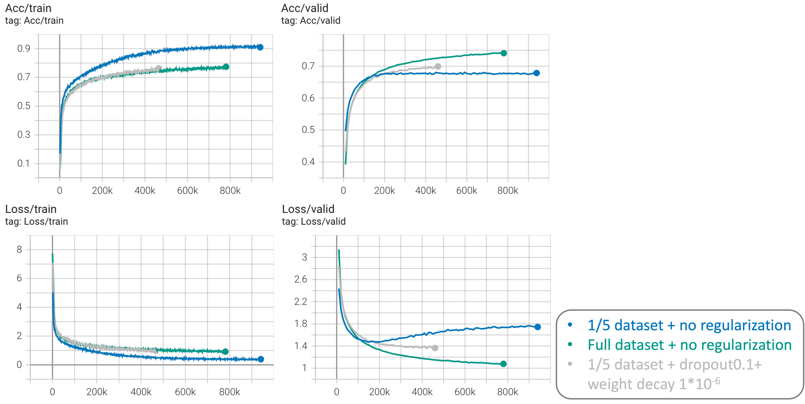
|dataset|vocab size|batch|lr|weight decay|d_model|h|ff|layers|dropout|epoch|train/acc|valid/acc|
|:---:|:---:|:---:|:---:|:---:|:---:|:---:|:---:|:---:|:---:|:---:|:---:|:---:|
|1/5|5k|128|$1*10^{-4}$|0|1024|8|2048|6|0|418|0.91|0.68|
|1/5|5k|128|$1*10^{-4}$|$1*10^{-6}$|1024|8|2048|6|0.1|207|0.76|0.7|
|full|5k|128|$1*10^{-4}$|0|1024|8|2048|6|0|70|0.77|0.74|
  - ***dataset이 적으면 overfitting이 발생하기 쉽고, regularization을 넣어줌으로써 overfitting을 막을 수 있다. 가장 좋은 것은 애초에 많은 데이터셋을 사용하는 것이다.***

* Trial 6.
  -
  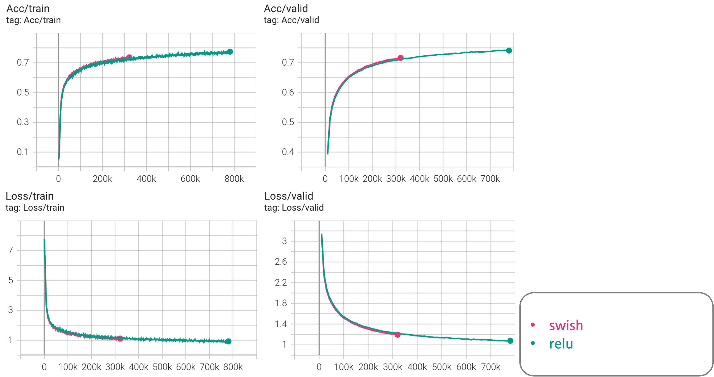
|vocab size|batch|lr|weight decay|d_model|h|ff|layers|dropout|epoch|train/acc|valid/acc|
|:---:|:---:|:---:|:---:|:---:|:---:|:---:|:---:|:---:|:---:|:---:|:---:|
|5k|128|$1*10^{-4}$|0|1024|8|2048|6|0|28|0.742|0.711|
|5k|128|$1*10^{-4}$|0|1024|8|2048|6|0|28|0.738|0.716|
  - 미세하지만 swish activation function이 더 좋은 성능을 보인다.

* Trial 7.
  -
  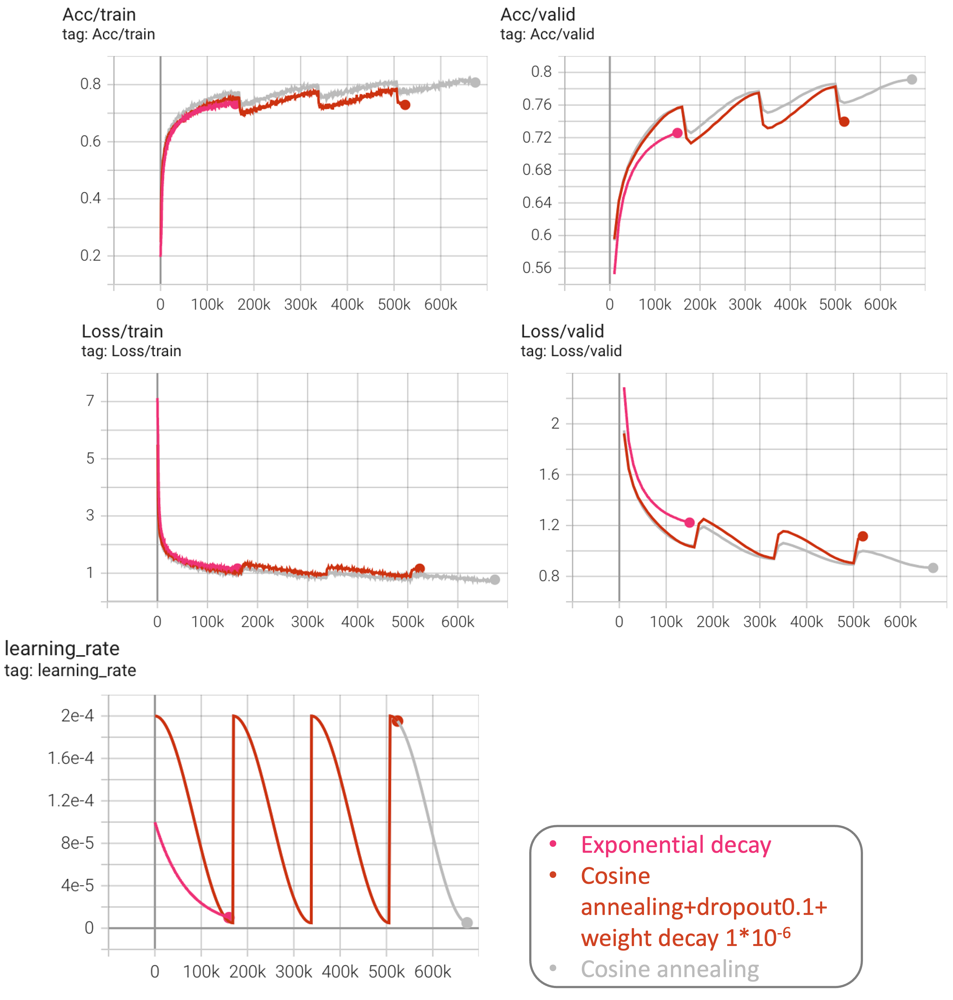
|vocab size|batch|lr|weight decay|d_model|h|ff|layers|dropout|epoch|train/acc|valid/acc|
|:---:|:---:|:---:|:---:|:---:|:---:|:---:|:---:|:---:|:---:|:---:|:---:|
|5k|128|$2*10^{-4}$|$1*10^{-6}$|1024|8|2048|6|0.1|28|0.789|0.783|
|5k|128|$2*10^{-4}$|0|1024|8|2048|6|0|45|0.816|0.791|
|5k|128|$1*10^{-4}$|0|1024|8|2048|6|0|15|0.731|0.726|

* 이외에도 최적의 model scale을 찾기 위해 다양한 batch size, d_model, layers 값을 주는 작업도 진행하였다.

#### fine tuning
* 데이터셋이 적어 fine tuning dataset 전체를 충분히 학습해도 30분이 걸리지 않는다. ray tune를 사용해 hyper parameter를 탐색하기 적합하다고 판단하여 ray tune을 사용하였다. 

* Trial 1.
  -
  - search parameter
    ```
    conv_filters: [100, 200, 300]
    freeze mode: [pretrained model 전체 freeze, pretrained model의 마지막 encoder layer 제외한 나머지 freeze]
    kernel_sizes: [[3,4,5], [4,5,6,7]]
    learning_rate: [0.001, 0.0001, 0.00005]
    dropout: [0.2, 0.5]
    ```
  

  - valid accuracy가 대부분 0.78~0.81에 위치하고있으며 괄목할만한 결과가 없다.
  - 매번 전부 탐색해볼 수 없으므로, 현 결과에서 valid acc가 높은 4개, valid loss가 가장 낮은 4개를 선택하여 진행하였다. 이 8개의 조합에서 일관성있는 hyper parameter는 없었다.
* Trial 2.
  -
  - search parameter
    ```
    weight_decay: [0.001, 0.0001]
    dropout: [0, 0.2, 0.5]
    ```
  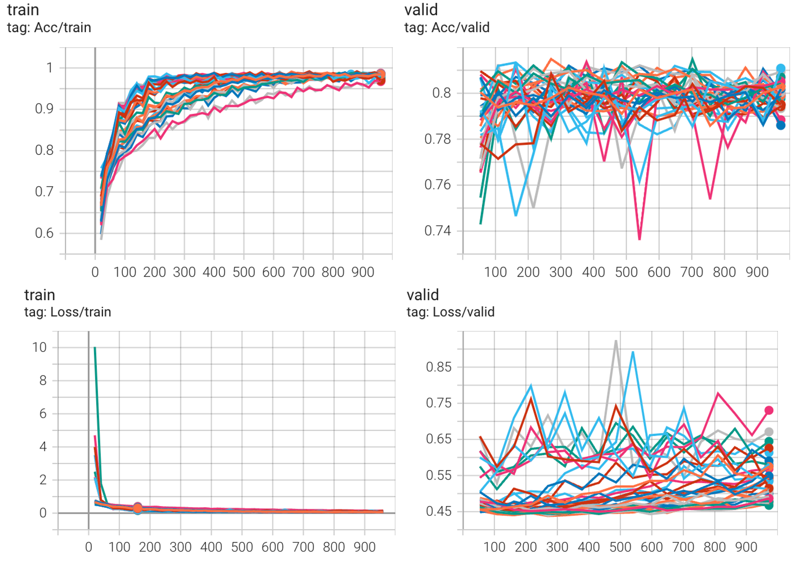

* Trial 3.
  -
  - search parameter
    ```
    weight_decay: [0.01]
    dropout: [0, 0.2, 0.5]
    ```
  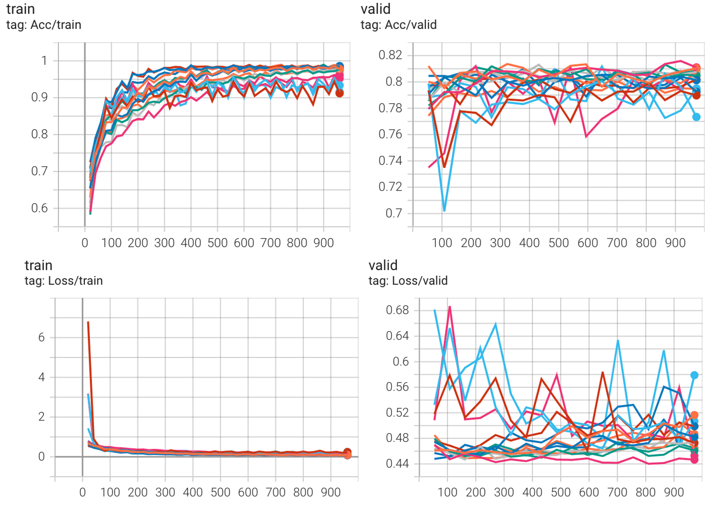

* Trial 4.
  -
- search parameter
    ```
    weight_decay: [0.1, 0.4]
    dropout: [0, 0.2, 0.5]
    ```
  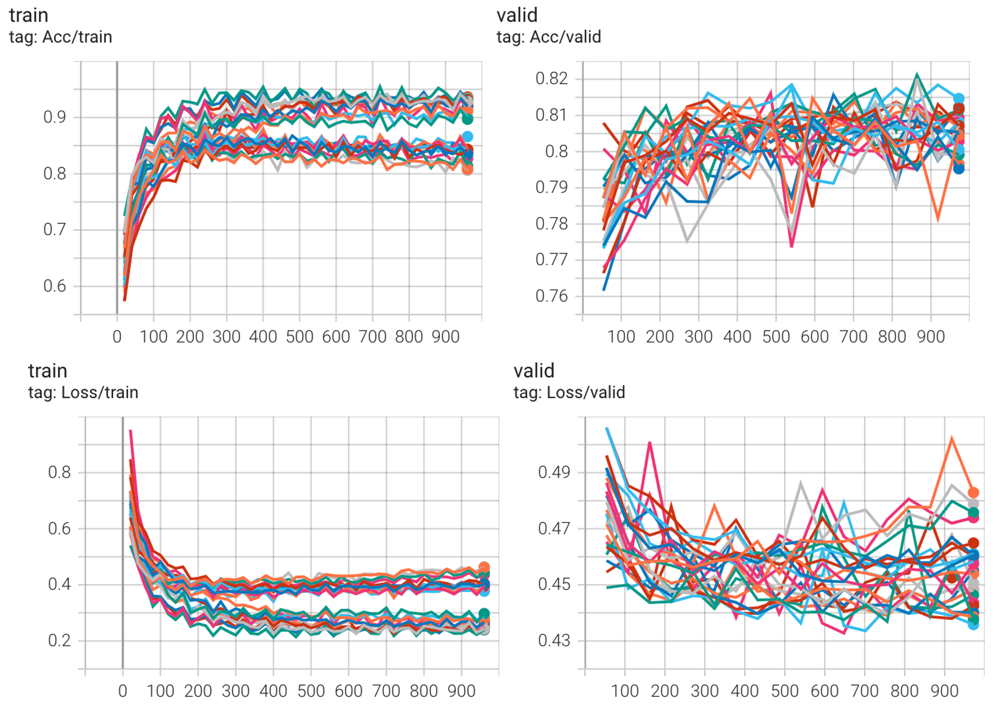

  - weight decay값이 커져 train acc, loss에 점수가 낮아졌다. validation 값은 큰 편화가 없었다.
* 마지막 3개의 encoder layer와 전체 encoder layer까지 학습시키는 시도를 해보았으니 이전 결과와 마찬가지로 0.78~0.81의 valid accuracy를 보였으며, 괄목할만한 결과가 나오지 않았다.

### Pile dataset
#### pretraining
* ray tune framework로 hyperparameter 탐색
  - search parameter
    ```
    d_model: [512, 768, 1024, 1536]
    ff: [2048, 3072, 4096]
    h: [8, 12, 16]
    layer: [3, 6, 9]
    learning_rate: [0.00001~0.0005]
    ```

  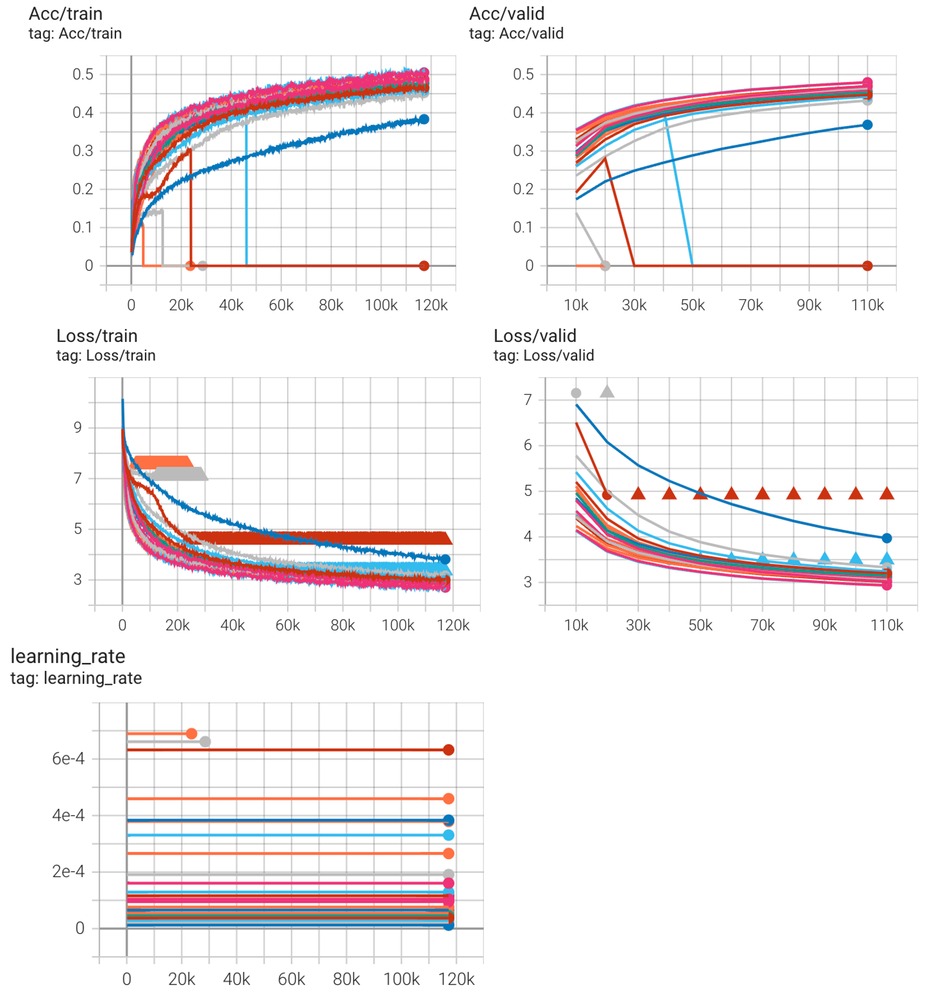

- 최고 성능을 낸 두 가지 hyper parameter 조합

|batch|lr|weight decay|d_model|h|ff|layers|dropout|epoch|train/acc|valid/acc|
|:---:|:---:|:---:|:---:|:---:|:---:|:---:|:---:|:---:|:---:|:---:|
|128|$2*10^{-4}$|0|1024|8|2048|6|0|15|0.51|0.48|
|128|$1*10^{-4}$|0|1536|12|2048|6|0|15|0.51|0.48|
  * dimension size 증가에 따른 모델 scale 및 학습시간 증가를 고려하여 성능차이가 크게 없는 d_model 1024로 선택하였다.
    - 이 조합은 AI Hub에서 찾은 hyper parameter 조합과 동일하다.

  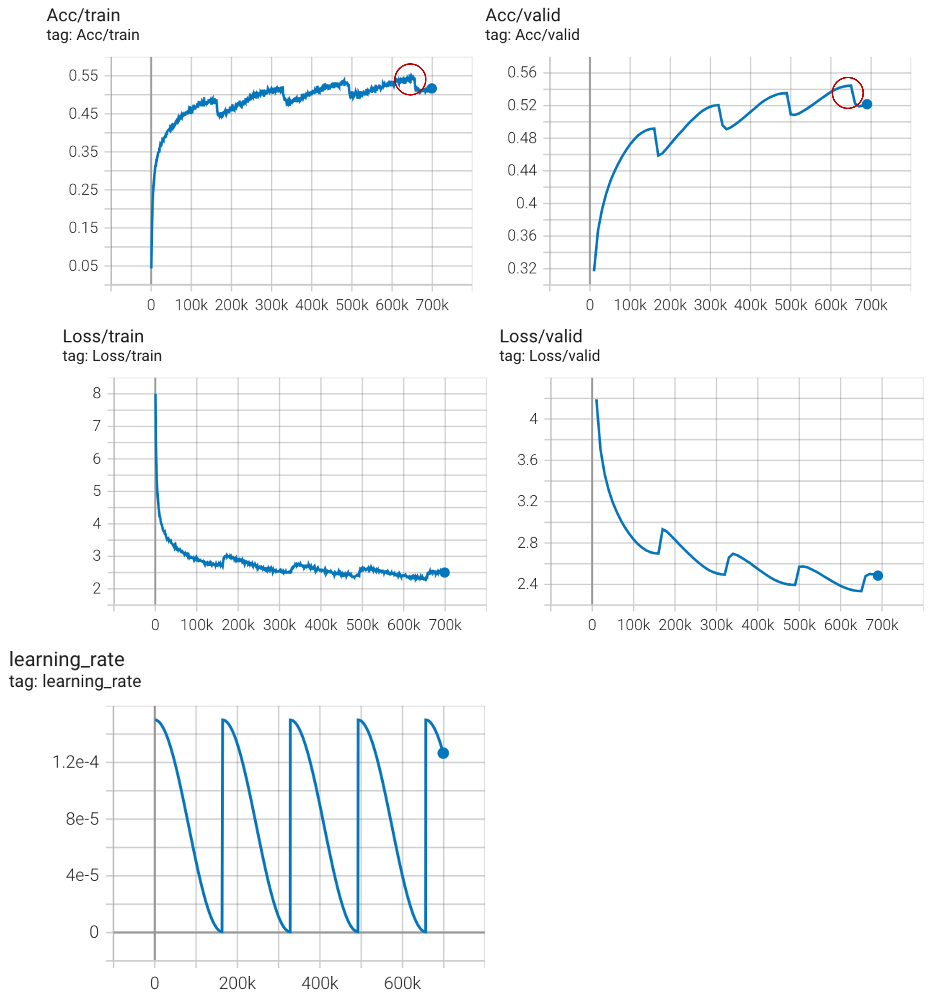

|vocab size|batch|lr|weight decay|d_model|h|ff|layers|dropout|epoch|train/acc|valid/acc|
|:---:|:---:|:---:|:---:|:---:|:---:|:---:|:---:|:---:|:---:|:---:|:---:|
|30k|128|$2*10^{-4}$|0|1024|8|2048|6|0|28|0.55|0.54|

## Lessons Learned
 - torch.exp(), torch.log()를 쓰거나, 값을 나눌 경우 값이 inf(무한대) 혹은 NaN(Not a number) 문제가 발생할 수 있음을 인지하고 구현해야 한다.

## Conclusion and Constraints
1. 초반에 hyper parameter를 탐색할 때는 큰 단위의 step으로 구분하여 탐색하는 것이 좋다. 큰 차이 없는 hyper parameter를 비교할 때는 성능 수치상으로도 큰 차이를 안내기 때문이다. 그 후 괄목할만한 hyper parameter가 나온다면 해당 hyper parameter에서 적은 step으로 세분화하여 탐색하는 것이 효율적인 것으로 보인다.

2. 데이터셋이 적다면 dropout, weight decay같은 regularization을 추가하여 train데이터 학습에 방해를 주어 overfitting하지 않도록 막아준다. 데이터셋이 충분히 많다면 regularization을 주지 않아도 충분히 좋은 성능을 뽑아낼 수 있다.

3. 일정한 learning rate를 주는 것보다 적절한 learning rate scheduler를 사용하는 것이 당연히 좋은 결과를 보인다. 최고의 hyper parameter 조합을 찾은 상태에서 다양한 learning rate scheduler를 사용하는 것이 효율적일 것이다.

4. 한정된 resource를 고려하면 batch size와 model scale은 반비례한다. 이를 고려해 적절한 hyper parameter를 찾아야한다.

## Future Work
- fine tuning task의 데이터셋이 적은 관계로 다양한 방법을 시도해도 validation accuracy가 나아지지 않는다. data augmentation과 같은 방식으로 validation accuracy를 개선시킬 방법을 모색해야한다.
- Pile 데이터셋으로 pretraining한 모델을 기반으로 fine tuning을 시도한다. AI Hub 데이터셋으로 pretraining한 모델과 다른 결과가 나올지 확인이 필요하다.
- fine tuning 후, 성능 평가 지표를 confusion matrix로 시각화한다.

## References
* Entire architecture of transformer: [Attention is all you need](https://arxiv.org/abs/1706.03762)
* BPE: [Neural Machine Translation of Rare Words with Subword Units](https://arxiv.org/abs/1508.07909v5)
* Masked Language Model: [BERT: Pre-training of Deep Bidirectional Transformers for Language Understanding](https://arxiv.org/abs/1810.04805)
* Masked Language Model-2: [RoBERTa: A Robustly Optimized BERT Pretraining Approach](https://arxiv.org/abs/1907.11692)
* training dataset: [AI-hub; 한국어-영어 번역(병렬) 말뭉치](https://aihub.or.kr/aihubdata/data/view.do?currMenu=115&topMenu=100&dataSetSn=126)
