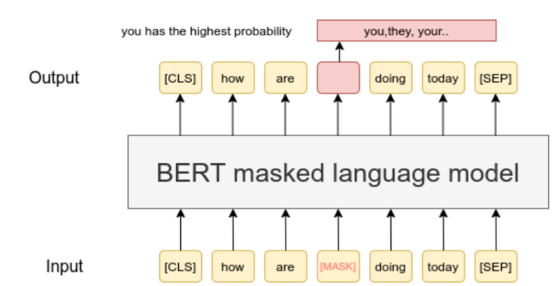

# Lanaguage Model(LM) Using transformer encoder
- Transformer의 Encoder stack을 사용한 BERT 모델 학습 연구 보고서

## Introduction / 서론
<!-- 왜 트랜스포머를 시작했고 BERT를 했는지에 대한 설명. -->
- 첫 study 대상으로 Transformer 모델을 선택하였다.
  - Transformer는 기존의 NLP 모델의 한계를 뛰어넘은 모델로 현재도 많은 모델이 Transformer의 인코더와 디코더를 기반으로 만들어지고있으며, 최근에는 NLP뿐만 아니라 Vision에서도 좋은 결과를 보이고있다.
- 재해탐지 분야 관련 NLP Task로 다양한 정보가 실시간으로 올라오는 트위터 메시지를 통해 실제로 발생한 재난/재해와 연관이 있는 메시지인지 분류하는 Task를 선정했다.
- Transformer의 encoder 기반의 BERT 모델은 문장 내 앞뒤 문맥을 모두 살필 수 있다는 양방향 성격을 가지고, decoder 기반의 GPT 모델은 문장 시작부터 순차적으로 계산하는 일방향 성격을 가지고 있다.
- 이런 이유로 GPT는 문장 생성에 강하고 BERT는 문장의 의미를 추출해내는데 강점을 가지고 있는 모델이다.
- BERT 모델이 문장을 분류하는 task에서 뛰어난 결과를 보였기 때문에 BERT 모델을 실험 모델로 선정하였다.
- BERT 논문에 따르면 대표적으로 아래 4가지 유형에서 모델을 활용할 수 있다. 트위터 재해탐지 Task는 단일 문장 분류에 속한다.
  1. 단일 문장 분류 (Single Sentence Classification Tasks)
  2. 두 문장의 관계 분류 (Sentence Pair Classification Tasks)
  3. 문장 내 단어 라벨링 (Single Sentence Tagging Tasks)
  4. 묻고 답하기 (Quesiton & Answering Tasks)

## Preliminaries / 선행 연구
- Transformer
  - 2017년 구글에서 발표한 논문 "Attention is all you need"에서 소개된 모델로 인코더-디코더 구조를 가지고있다.  
  

  - 아래와 같은 component로 구성되어있다.
    * Input Embedding
    * Positional encoding
    * encoder
      * multi head attention
      * feed forward
      * add & layernorm
      * residual connection
    * decoder
      * masked multi head attention
      * multi head attention
      * feed forward
      * add & layernorm
      * residual connection

## Methods / 연구 방법
### dataset
* pre-train, fine tuning 학습에 사용한 데이터셋 소개
#### pre-training dataset
* pre-training을 위해서 AI Hub와 Pile 데이터셋으로 학습을 하였다.
* AI Hub - 한국어-영어 번역(병렬) 말뭉치
  - AI 번역 엔진 개발을 위한 총 160만문장의 학습용 문장을 구축한 자연어 데이터를 제공한다.  
  

  - https://aihub.or.kr 에서 회원가입 후 다운로드 요청을 해야한다. 관리자가 승인 후 다운로드 가능하다.
  - 데이터 예시)  
    

* The Pile
  - AI Hub 데이터셋보다 많은 양으로 학습하기 위해 Pile 데이터셋으로도 pre-training을 하였다.
  - 언어 모델 학습을 위한 800GB 이상의 대규모 학습 데이터세트로 구성된 영어 오픈 소스 데이터 세트이다.
  - github, ArXiv, wikipedia, youtube 자막, 웹텍스트 등 총 22개의 하위 데이터세트로 구성되어있다.  
    

  - The Pile 공식 홈페이지 https://pile.eleuther.ai/ 에서 데이터셋을 다운로드받거나 리눅스에서 아래 명령어로 다운로드 받을 수 있다. (2023년 10월을 기준으로 다운로드 링크가 정상적이지 않아 다운로드받을 수 없는 상태이다.)
    ```shell
    wget -c (--tries=0) https://the-eye.eu/public/AI/pile/train/*.zst
    ```

#### fine tuning dataset
* fine tuning은 kaggle에서 제공하는 트위터 재해 데이터셋을 사용한다.
* kaggle - tweet disaster dataset
  - 일반 트윗 메시지와 재난 관련 트윗 메시지가 혼합되어 트윗 메시지가 재난/재해와 연관이 있는지 구분하는 데이터셋이다.
  - 총 7613개의 학습용 문장/라벨을 제공한다.
  - https://www.kaggle.com/competitions/nlp-getting-started/data 에서 로그인 후 다운로드를 할 수 있다.
  - 데이터 예시)  
    

### models
#### pre-training (사전 학습)
* pre-training방법으로 BERT 논문의 masked language model을 사용하였다.
* masked language model은 입력 문장에서 임의의 단어를 가리고, 모델이 가려진 위치의 단어를 예측한다. 가려진 단어의 앞 뒤 문맥만 가지고 예측하기 때문에 이 과정을 통해 모델은 문맥 정보를 잘 활용할 수 있게 된다.  


- BERT 논문에 따르면, 입력 token 중 15% token을 예측하게되는데, 그 15%의 token을 아래 비율대로 처리한다.
  - 80%: [MASK] token으로 변경
  - 10%: 임의의 token으로 변경
  - 10%: 변경하지 않고 그대로 둔다. 정답을 그대로 예측하는 이유는 올바른 정답에 대해 bias를 주기 위함이다.

#### fine tuning (미세 조정)
- fine tuning은 pre-training 과정으로 학습된 모델을 기반으로 트위터 메시지 재해 탐지를 할 수 있도록 모델에 일부 레이어를 변형/추가하고 학습하는 과정이다.
- fine tuning을 위한 classification layer는 Convolutional Neural Networks for Sentence Classification 논문의 모델을 참고하여 적용하였다.
  - 간단한 CNN모델으로 여러 classification task에서 SOTA를 달성하였고 다양한 문장 길이에도 적용할 수 있는 장점이 있다.  
- Convolutional Neural Networks for Sentence Classification  
  

- BERT + CNN classifier  
  
  - pre-train한 모델의 top layer에 cnn classification layer를 사용한다.
## Experiments / 실험 내역
### AI Hub dataset
#### pre-training
* pre-training hyper parameter를 탐색하는 과정은 자동 탐색 툴을 사용하지 않고 직접 수동으로 탐색하였다. 이 과정은 한번의 학습당 짧게는 1일, 길게는 일주일 이상이 소요되었다.
* 총 학습을 반복한 횟수는 약 100번이며,  서버의 GPU 2대를 전부 사용하여 약 3개월이 소요되었다.
* 최종 pre-training 모델
  -
  
|vocab size|batch|lr|weight decay|d_model|h|ff|layers|dropout|epoch|train/acc|valid/acc|
|:---:|:---:|:---:|:---:|:---:|:---:|:---:|:---:|:---:|:---:|:---:|:---:|
|5k|128|$2*10^{-4}$|0|1024|8|2048|6|0|60|0.817|0.791|
  - 최종적으로 6일간 60 에포크를 학습하여 valid accuracy 79%를 달성하는 결과물이 학습되었다.
  - pre-training 과정에서 찾은 모델의 총 파라미터 수는 58M으로, 논문에서 나온 BERT-base의 파라미터 수 110M에 비하면 절반정도, BERT-large의 파라미터 수 340M에 비하면 20%도 안되는 작은 규모의 모델이다.  
    

#### fine tuning
* 데이터셋이 적어 fine tuning dataset 전체를 충분히 학습해도 30분이 걸리지 않았다. ray tune를 사용해 hyper parameter를 탐색하기 적합하다고 판단하여 ray tune을 사용하였다. 
* GPU가 아닌 colab으로 학습을 하였으며, 총 144가지수의 hyper parameter 탐색을 하였고 약 일주일 정도의 기간이 소요되었다.
* Trial 1.
  -
  - 아래와 같은 구성으로 hyper parameter 탐색을 하였다. 이는 Convolutional Neural Networks for Sentence Classification 논문에서 제시한 hyper parameter를 기준으로 삼았다.
    ```
    conv_filters: [100, 200, 300]
    freeze mode: [pre-trained model 전체 freeze, pre-trained model의 마지막 encoder layer 제외한 나머지 freeze]
    kernel_sizes: [[3,4,5], [4,5,6,7]]
    learning_rate: [0.001, 0.0001, 0.00005]
    dropout: [0.2, 0.5]
    ```
  

  - valid accuracy가 대부분 0.78~0.81에 위치하고있으며 괄목할만한 결과가 없다.
  - 매번 전부 탐색해볼 수 없으므로, 현 결과에서 valid acc가 높은 4개, valid loss가 가장 낮은 4개를 선택하여 진행하였다. 이 8개의 조합에서 일관성있는 hyper parameter는 없었다.(Appendix 참조)

### Pile dataset
#### pre-training
* hyperparameter 탐색
  -
  - ray tune framework를 사용하여 Pile 데이터셋을 pre-training하기위한 hyperparameter을 탐색하였다.
  - 1개의 GPU로 총 200가지의 탐색을 수행하였고 GPU 메모리의 한계로 실제로 학습이된 모델은 22가지이다. 약 30일의 기간이 소요되었다.
  - search parameter
    ```
    d_model: [512, 768, 1024, 1536]
    ff: [2048, 3072, 4096]
    h: [8, 12, 16]
    layer: [3, 6, 9]
    learning_rate: [0.00001~0.0005]
    ```


  - 최고 성능을 낸 두 가지 hyper parameter 조합

  |batch|lr|weight decay|d_model|h|ff|layers|dropout|epoch|train/acc|valid/acc|
  |:---:|:---:|:---:|:---:|:---:|:---:|:---:|:---:|:---:|:---:|:---:|
  |128|$2*10^{-4}$|0|1024|8|2048|6|0|15|0.51|0.48|
  |128|$1*10^{-4}$|0|1536|12|2048|6|0|15|0.51|0.48|
  * dimension size 증가에 따른 모델 scale 및 학습시간 증가를 고려하여 성능차이가 크게 없는 d_model 1024로 선택하였다.
    - 이 조합은 AI Hub에서 찾은 hyper parameter 조합과 동일하다.
* full training  
  - 
  - hyper parameter 탐색을 통해 찾은 최고의 조합으로 최종 학습을 하였다. 6일의 학습 기간이 소요되었다.
  

|vocab size|batch|lr|weight decay|d_model|h|ff|layers|dropout|epoch|train/acc|valid/acc|
|:---:|:---:|:---:|:---:|:---:|:---:|:---:|:---:|:---:|:---:|:---:|:---:|
|30k|128|$2*10^{-4}$|0|1024|8|2048|6|0|28|0.55|0.54|
  - AI Hub에 비해 vocab size가 훨씬 컸기 때문에 accuracy 수치가 상대적으로 낮게 나왔다.

## Lessons Learned / 시행 착오
 - torch.exp(), torch.log()를 쓰거나, 값을 나눌 경우 값이 inf(무한대) 혹은 NaN(Not a Number) 문제가 발생할 수 있음을 인지하고 구현해야 한다.

## Conclusion / 결론
  1. fine tuning 모델을 통해 영어 트윗 메시지가 재난/재해와 연관이 있는지 없는지 판단할 수 있는 모델을 만들었다. 모델을 이용해 실시간 트윗 메시지를 통해 실시간 재난/재해를 탐지할 수도 있다. 또한 한글 데이터셋을 수집하여 모델을 학습시킨다면 영어뿐만 아니라 한글 SNS 메시지로도 재난/재해를 탐지할 수 있다.
  2. 학습 데이터가 충분치는 않았지만, AI Hub와 Pile 데이터셋을 통해 pre-training된 BERT모델을 학습하였다. 이 모델은 tweet 메시지 분류 뿐만 아니라 다양한 목적의 NLP task에 활용될 수 있다.
  3. 데이터 수집 및 전처리부터 fine tuning까지 일련의 NLP 학습 과정을 거침으로써, 다양한 데이터셋과 모델을 선택하여 학습할 수 있는 기반을 만들어놓았다.
<!-- 1. 초반에 hyper parameter를 탐색할 때는 큰 단위의 step으로 구분하여 탐색하는 것이 좋다. 큰 차이 없는 hyper parameter를 비교할 때는 성능 수치상으로도 큰 차이를 안내기 때문이다. 그 후 괄목할만한 hyper parameter가 나온다면 해당 hyper parameter에서 적은 step으로 세분화하여 탐색하는 것이 효율적인 것으로 보인다.

2. 데이터셋이 적다면 dropout, weight decay같은 regularization을 추가하여 train데이터 학습에 방해를 주어 overfitting하지 않도록 막아준다. 데이터셋이 충분히 많다면 regularization을 주지 않아도 충분히 좋은 성능을 뽑아낼 수 있다.

3. 일정한 learning rate를 주는 것보다 적절한 learning rate scheduler를 사용하는 것이 당연히 좋은 결과를 보인다. 최고의 hyper parameter 조합을 찾은 상태에서 다양한 learning rate scheduler를 사용하는 것이 효율적일 것이다.

4. 한정된 resource를 고려하면 batch size와 model scale은 반비례한다. 이를 고려해 적절한 hyper parameter를 찾아야한다. -->

## Future Work / 향후 계획
- data augmentation 등의 방식으로 validation accuracy를 개선시킬 방법을 모색해야한다.
- Pile 데이터셋으로 pre-training한 모델을 기반으로 fine tuning을 시도한다. AI Hub 데이터셋으로 pre-training한 모델과 다른 결과가 나올지 확인이 필요하다.
- fine tuning 후, 성능 평가 지표를 confusion matrix로 시각화한다.
- fine tuning된 모델로 kaggle NLP with disaster tweets 평가용 데이터셋을 예측하여 competetion에 제출한다.
- 학습 가능한 GPU가 추가된 후, Pile 데이터셋을 1000만개로 늘리고 모델 크기를 더 확장하여 모델 pre-training을 한다. (학습하는데 2개월 이상 소요 예상)

## References / 참고 문헌
* Entire architecture of transformer: [Attention is all you need](https://arxiv.org/abs/1706.03762)
* BPE: [Neural Machine Translation of Rare Words with Subword Units](https://arxiv.org/abs/1508.07909v5)
* Masked Language Model: [BERT: Pre-training of Deep Bidirectional Transformers for Language Understanding](https://arxiv.org/abs/1810.04805)
* Masked Language Model-2: [RoBERTa: A Robustly Optimized BERT Pretraining Approach](https://arxiv.org/abs/1907.11692)
* training dataset: [AI-hub; 한국어-영어 번역(병렬) 말뭉치](https://aihub.or.kr/aihubdata/data/view.do?currMenu=115&topMenu=100&dataSetSn=126),
[The pile](https://pile.eleuther.ai/)
* finetuning: [Convolutional Neural Networks for Sentence Classification](https://arxiv.org/abs/1408.5882)

## Appendix / 부록
### tokenization
* 데이터셋을 모델에 입력/출력 데이터로 사용할 수 있도록 문자를 토큰 단위로 나누는 전처리 작업이다.
* BPE (Byte pair encoding)
  - 데이터에서 가장 많이 등장한 문자열을 병합해서 데이터를 압축하는 기법이다.  
  

  - 생성된 BPE 사전  
    

### BERT dynamic masking
- BERT 논문에서 제시한 static masking을 사용하지 않고 RoBERTa 논문에서 제시한 dynamic masking 방식을 참고하였다.  
  

  - RoBERTa의 경우 고정된 mask token이 아닌 10가지 masking을 각각 4번 반복하여 학습한다.(40 epochs)
    - BERT의 static masking보다 뛰어난 성능을 보인다.
  - RoBERTa의 방식에서 더 나아가 매 epoch마다 random하게 새로 masking하는 방식을 사용한다.
- 연속된 문장이 없는 데이터셋 특성을 고려하여 [CLS], [SEP] 토큰 제거하고 단일 문장을 학습에 사용했다.
- BERT output token에서 linear transform을 사용하지 않고 embedding을 사용한다.
  - linear를 사용하지 않으므로 학습에 필요한 parameter수가 줄어들고 성능은 좋아진다.

### Experiments / 실험 내역
#### AI Hub dataset
##### pre-training
* Trial 1 - 한글, 영어가 섞인 데이터셋으로 학습
  - 

  

  

  - 영어 dataset이 한글 dataset에 비해 훨씬 좋은 score를 내고있다.
    - 알파벳으로만 구성된 영어와 자음, 모음, 받침으로 구분된 한글 언어적 특성 차이에 따른 성능 차이가 발생했다.
  - 언어간 학습 편차를 없애고 fine tuning을 위한 학습에 집중하기 위해 이후 영어 데이터셋만 사용했다.

* Trial 2 - weight decay 비교
  - 
  
|batch|lr|weight decay|d_model|h|ff|layers|dropout|epoch|train/acc|valid/acc|
|:---:|:---:|:---:|:---:|:---:|:---:|:---:|:---:|:---:|:---:|:---:|
|256|$5*10^{-4}$|$1*10^{-5}$|512|8|2048|3|0.1|32|0.44|0.45|
|256|$5*10^{-5}$|$1*10^{-5}$|512|8|2048|3|0.1|32|0.51|0.52|
|256|$5*10^{-6}$|$1*10^{-5}$|512|8|2048|3|0.1|32|0.53|0.54|
  - weight decay $5*10^{-6}$가 가장 좋은 성능을 보였다.
  - 모델이나 데이터셋 특성에 따라 최적의 weight decay의 편차가 크다.

* Trial 3 - BPE 사전 크기에 따른 성능 비교
  -
  
|vocab size|batch|lr|weight decay|d_model|h|ff|layers|dropout|epoch|train/acc|valid/acc|
|:---:|:---:|:---:|:---:|:---:|:---:|:---:|:---:|:---:|:---:|:---:|:---:|
|10k|256|$5*10^{-5}$|$1*10^{-5}$|512|8|2048|3|0.1|31|0.57|0.59|
|20k|256|$5*10^{-5}$|$1*10^{-5}$|512|8|2048|3|0.1|31|0.53|0.54|
|30k|256|$5*10^{-5}$|$1*10^{-5}$|512|8|2048|3|0.1|31|0.51|0.52|
  - vocab size가 적을 수록 높은 score 달성했다.
  - vocab size가 적을수록 모델이 예측해야하는 선택 수가 적어지므로 좋은 score를 내는 것으로 보인다.
  - 그렇다면 극단적으로 줄여서 단어가 아닌 문자만으로 vocab을 구성하면 더 좋은 결과가 나올지 의문이다.
    - vocab size가 작아질수록 학습 문장 구성 token의 갯수가 많아지는 부분은 존재한다.

* Trial 4 - learning rate 에 따른 학습 성능 비교
  -
  
|vocab size|batch|lr|weight decay|d_model|h|ff|layers|dropout|epoch|train/acc|valid/acc|
|:---:|:---:|:---:|:---:|:---:|:---:|:---:|:---:|:---:|:---:|:---:|:---:|
|10k|256|$5*10^{-4}$|$1*10^{-6}$|512|8|2048|3|0.1|39|0.60|0.62|
|10k|256|$5*10^{-5}$|$1*10^{-6}$|512|8|2048|3|0.1|39|0.58|0.60|
  - learning rate $5*10^{-4}$ 가 더 빠르게 학습한다.

* Trial 5 - 데이터셋 크기와 regularization 비교
  -
  
|dataset|vocab size|batch|lr|weight decay|d_model|h|ff|layers|dropout|epoch|train/acc|valid/acc|
|:---:|:---:|:---:|:---:|:---:|:---:|:---:|:---:|:---:|:---:|:---:|:---:|:---:|
|1/5|5k|128|$1*10^{-4}$|0|1024|8|2048|6|0|418|0.91|0.68|
|1/5|5k|128|$1*10^{-4}$|$1*10^{-6}$|1024|8|2048|6|0.1|207|0.76|0.7|
|full|5k|128|$1*10^{-4}$|0|1024|8|2048|6|0|70|0.77|0.74|
  - 1/5 dataset에 regularization을 적용하지 않으면 overfitting이 발생하였고 dropout, weight decay같은 regularization을 적용해서 overfitting을 막을 수 있다.
  - full dataset으로 regularization없이 학습한 경우, overfitting이 발생하지 않았고 validation성능도 가장 좋았다.
  - ***dataset이 적으면 overfitting이 발생하기 쉽고, regularization을 넣어줌으로써 overfitting을 막을 수 있다. 가장 좋은 것은 애초에 많은 데이터셋을 사용하는 것이다.***

* Trial 6 - activation function 비교
  -
  
|vocab size|batch|lr|weight decay|d_model|h|ff|layers|dropout|epoch|train/acc|valid/acc|
|:---:|:---:|:---:|:---:|:---:|:---:|:---:|:---:|:---:|:---:|:---:|:---:|
|5k|128|$1*10^{-4}$|0|1024|8|2048|6|0|28|0.742|0.711|
|5k|128|$1*10^{-4}$|0|1024|8|2048|6|0|28|0.738|0.716|
  - transformer의 논문에서 제안하는 relu가 아닌 swish를 사용하여 학습한뒤 성능을 비교하였다.
  - 미세하지만 swish activation function이 더 좋은 성능을 보인다.
* 이외에도 최적의 model scale을 찾기 위해 다양한 batch size, d_model, layers 값을 주는 작업도 진행하였다.

* Trial 7 - learning rate scheduler 비교
  -
  
|vocab size|batch|lr|weight decay|d_model|h|ff|layers|dropout|epoch|train/acc|valid/acc|
|:---:|:---:|:---:|:---:|:---:|:---:|:---:|:---:|:---:|:---:|:---:|:---:|
|5k|128|$2*10^{-4}$|$1*10^{-6}$|1024|8|2048|6|0.1|28|0.789|0.783|
|5k|128|$2*10^{-4}$|0|1024|8|2048|6|0|45|0.816|0.791|
|5k|128|$1*10^{-4}$|0|1024|8|2048|6|0|15|0.731|0.726|
  - 회색 선이 최종 pre-training모델의 그래프로 exponential decay보다 cosine annealing scheduler가 더 좋은 성능을 보였다.
  - 적절한 learning rate에서 가장 빠른 폭으로 감소하는 exponential decay는 학습에 적합하지 않다.

##### fine tuning
* Trial 2.
  -
  - Trial 1에서 얻은 8가지 조합에서 weight decay를 주고, dropout을 다르게 하였다.
  - search parameter
    ```
    weight_decay: [0.001, 0.0001]
    dropout: [0, 0.2, 0.5]
    ```
  

  - weight decay를 줘도 특별히 좋은 결과가 나타나지 않았다.
* Trial 3.
  -
  - train accuracy가 여전히 높은 것을 보고 더 큰 weight decay를 주었다.
  - search parameter
    ```
    weight_decay: [0.01]
    dropout: [0, 0.2, 0.5]
    ```
  

  - 여전히 좋은 결과를 나타내지 않았다.
* Trial 4.
  -
  - 더 높은 weight decay를 주었다.
  - search parameter
    ```
    weight_decay: [0.1, 0.4]
    dropout: [0, 0.2, 0.5]
    ```
  

  - weight decay값이 커져 train acc, loss에 점수가 낮아졌다. validation 값은 큰 편화가 없었다.
  * 마지막 3개의 encoder layer와 전체 encoder layer까지 학습시키는 시도를 해보았으나 이전 결과와 마찬가지로 0.78~0.81의 valid accuracy를 보였으며, 괄목할만한 결과가 나오지 않았다. 데이터셋이 충분치 않아 문제가 발생하는 것으로 보인다. 
* Trial 5.
  -
  - encoder의 마지막 layer 일부를 삭제하여 abstraction level을 낮춰서 학습하였다.
  - search parameter
  ```
  conv_filters: 100
  kernel_sizes: 3, 4, 5
  learning_rate: 0.0001
  dropout: [0.2, 0.5, 0.7]
  remove_last_layers: [1, 2]
  unfreeze_last_layers: [0, 1]
  weight decay: [0.1, 0.2, 0.3]
  ```
  
* Trial 6.
  - train:valid 데이터셋 비율을 9:1에서 7:3으로 변경하여 학습하였다.
  - search parameter
  ```
  conv_filters: 100
  kernel_sizes: 3, 4, 5
  learning_rate: 0.0001
  dropout: [0.2, 0.5, 0.7]
  remove_last_layers: [1, 2]
  unfreeze_last_layers: [0, 1]
  weight decay: [0.1, 0.2, 0.3]
  ```
  
