# Training record
- Record of training model that only encoder stack like BERT.

## Training case
### case 1
- description: training model layer 4 and 6
- date: 2023/04/28 20:00~2023/05/02 17:40
- directory: output/model_20230428182127_1, output/model_20230428182728_1
- params:
  > batch_size: 256  
learning_rate: $5*10^{-4}$  
weight_decay: 0  
d_model: 512  
h: 8  
ff: 2048  
n_layers: 4 and 6  
p_dropout: 0.1  
seq_len: 256  
- datasets: ko&en unified vocab (size: 52458) & dataset
  - trains: 2884352, steps per epoch: 11267 valids: 320484, steps per epoch: 1252
- result: 
  - ___training loss decreases, valid loss increases. overfitting___
  - blue is layer 6, orange is layer 4 in below image
  - (logging iteration with epoch, not step.)

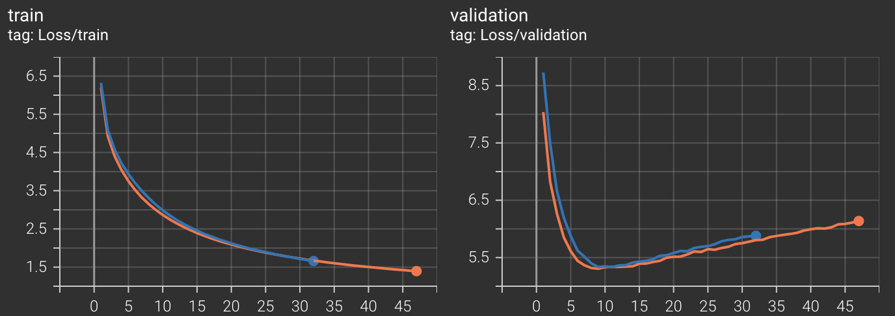

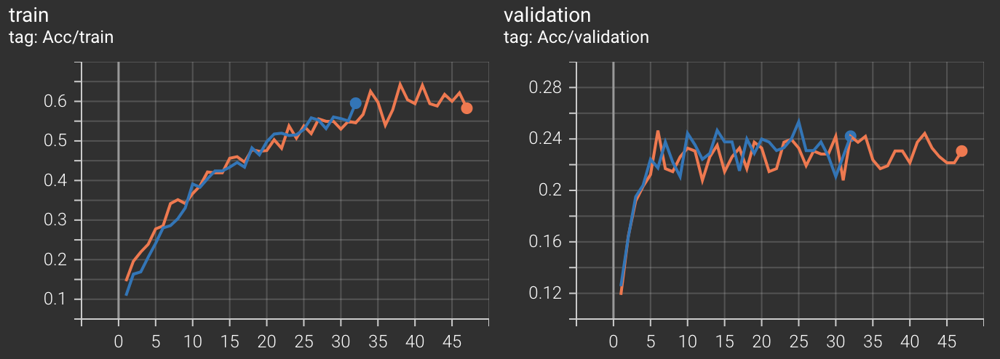

### case 2
- description: apply L2 weight decay 0.01 to case 1.
- date: 2023/05/04 20:20~2023/05/08 09:30
- directory: output/model_20230504181935_2, output/model_20230504181938_2
- params:
  > batch_size: 256  
learning_rate: $5*10^{-4}$  
weight_decay: 0.01  
d_model: 512  
h: 8  
ff: 2048  
n_layers: 4 and 6  
p_dropout: 0.1  
seq_len: 256  
- datasets: ko&en unified vocab (size: 52458) & dataset
  - trains: 2884352, steps per epoch: 11267 valids: 320484, steps per epoch: 1252
- result: 
  - ___underfitting. weight decay is too high.___
  - blue is layer 6, orange is layer 4 in below image
  - (logging iteration with epoch, not step.)

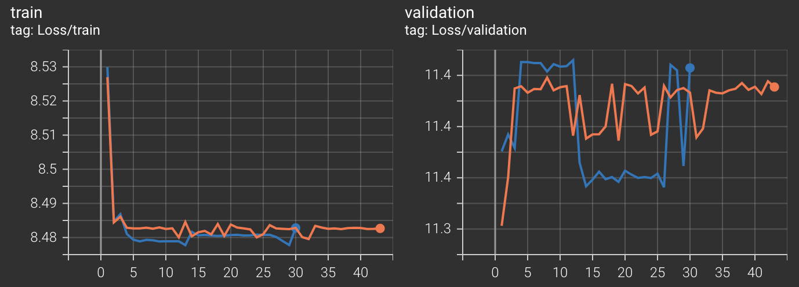

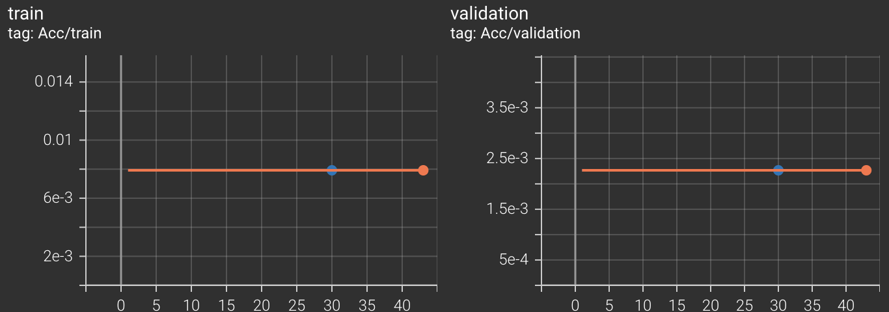

### case 3
- description: 
  - lower weight decay 0.001 to case 2
  - d_model 512 to 768
  - iteration with step.
- date: 2023/05/10 18:00~2023/05/11 10:30
- directory: output/model_20230510175614_3, output/model_20230510180434_3
- params:
  > batch_size: 256  
learning_rate: $5*10^{-4}$  
weight_decay: 0.001  
d_model: 768 and 512  
h: 8  
ff: 2048  
n_layers: 3 and 6  
p_dropout: 0.1  
seq_len: 256  
- datasets: ko&en unified vocab (size: 52458) & dataset
  - trains: 2884352, steps per epoch: 11267 valids: 320484, steps per epoch: 1252
- result: 
  - ___different scores depending on the dataset. english corpus get better score than korean corpus.___
  - blue is layer 6, orange is layer 3 in below image

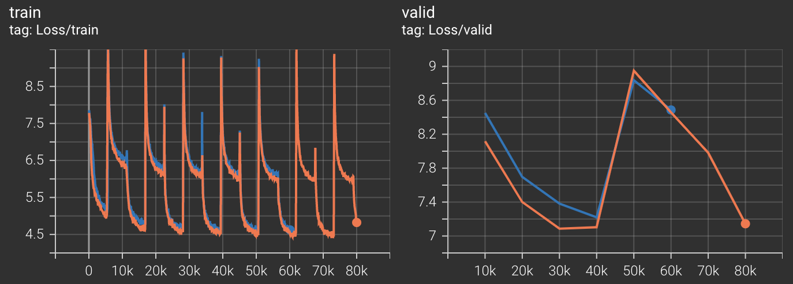

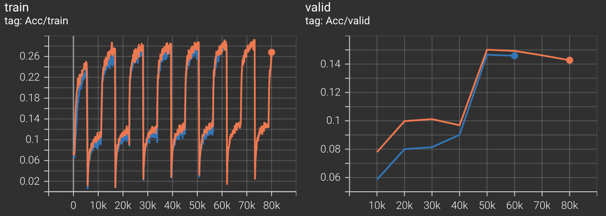

### case 4.
- description:
  - dataset corpus only ko
  - fixed mask token position on every epoch vs dynamic mask token position on every epoch
- date: 2023/05/10 18:00~2023/05/11 10:30
- directory: output/model_20230511161405_4, output/model_20230511185250_4
- params:
  > batch_size: 256  
learning_rate: $5*10^{-4}$  
weight_decay: 0.001  
d_model: 768  
h: 8  
ff: 2048  
n_layers: 3  
p_dropout: 0.1  
seq_len: 256  
- datasets: ko&en unified vocab (size: 52458) & only ko dataset
  - trains: 1442176, steps per epoch: 5634 valids: 160242, steps per epoch: 626
- result: 
  - ___fixed mask token getting better scores slightly than dynamic mask token.___
  - blue is dynamic mask token, orange is fixed mask token in below image.

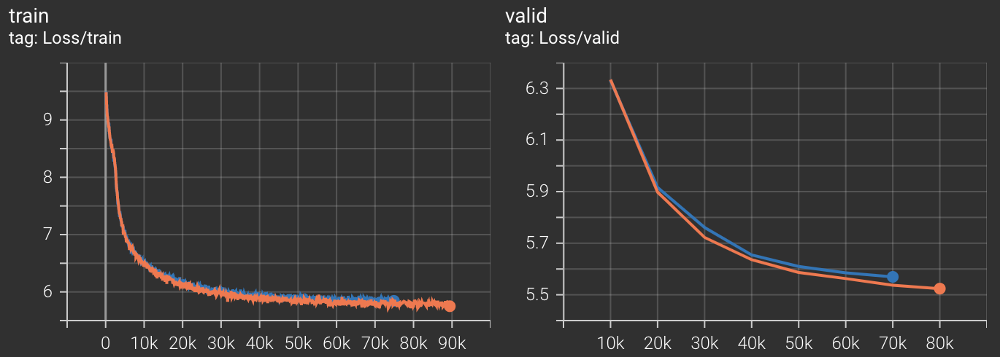

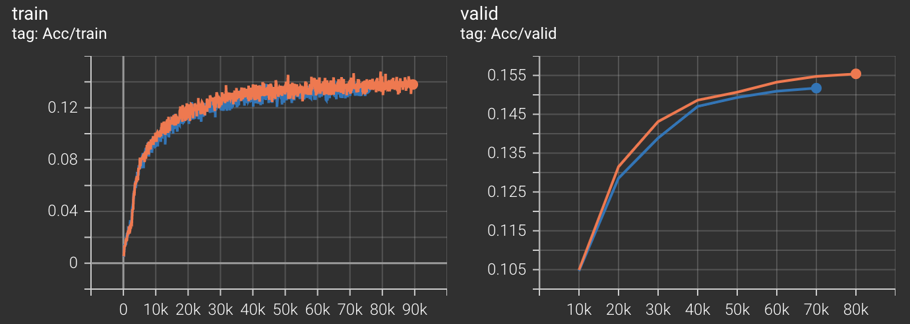

### case 5
- description: 
  - only en
  - weight decay $10^{-3}$ vs $10^{-4}$
- date: 2023/05/12 18:25~2023/05/15 09:25
- directory: output/only_en_L2e-03_5, output/only_en_L2e-04_5
- params:
  > batch_size: 256  
learning_rate: $5*10^{-4}$  
weight_decay: $10^{-3}$ and $10^{-4}$  
d_model: 768  
h: 8  
ff: 2048  
n_layers: 3  
p_dropout: 0.1  
seq_len: 256  
- datasets: ko&en unified vocab (size: 52458) & only en dataset
  - trains: 1442176, steps per epoch: 5634 valids: 160242, steps per epoch: 626
- result: 
  - ___weight decay 0.0001 got better score.___
  - blue is weight decay 0.0001, orange is weight dacy 0.001 in below image.

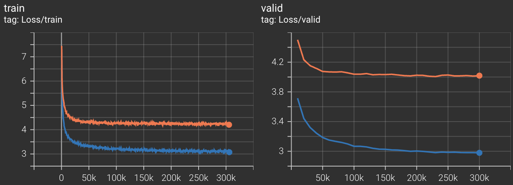

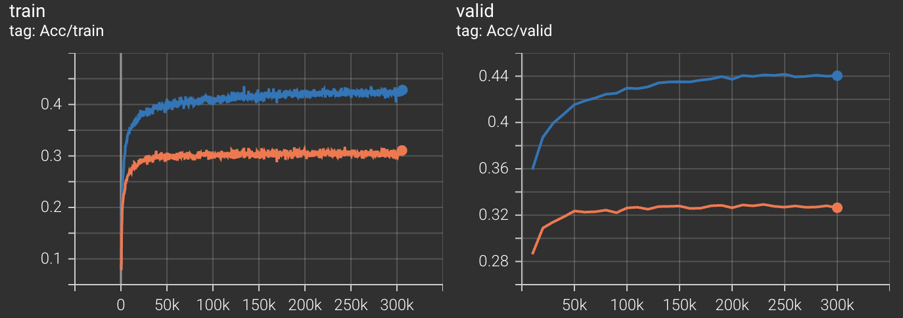

### case 6
 - description:
   - only en corpus
   - size of BPE vocab to 30000(size: 32458)
   - d_model-512, layer 2 vs 3 vs 6
- date: 2023/05/15 15:00~2023/05/16 17:10, 2023/05/17 09:00~2023/05/18 09:50
- directory: output/vocab30k_layer2, output/vocab30k_layer3, output/vocab30k_layer6
- params:
  > batch_size: 256  
learning_rate: $5*10^{-4}$  
weight_decay: $10^{-4}$  
d_model: 512  
h: 8  
ff: 2048  
n_layers: __2__ and __3__ and __6__  
p_dropout: 0.1  
seq_len: 256  
- datasets: ko&en _unified_ vocab (size: 32458) & only en dataset
  - trains: 1442176, steps per epoch: 5634 valids: 160242, steps per epoch: 626
- result: 
  - ___layer 6 is worst. Layers 2 and 3 are not significantly different.___
  - gray: layer2, pink: layer 3, green: layer 6 in below image.

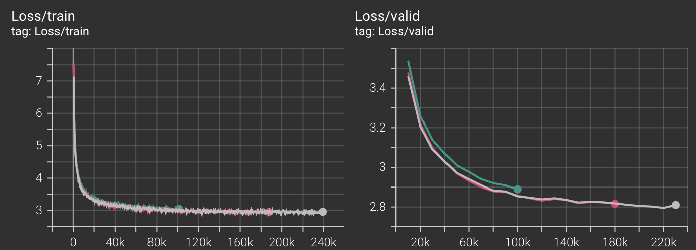

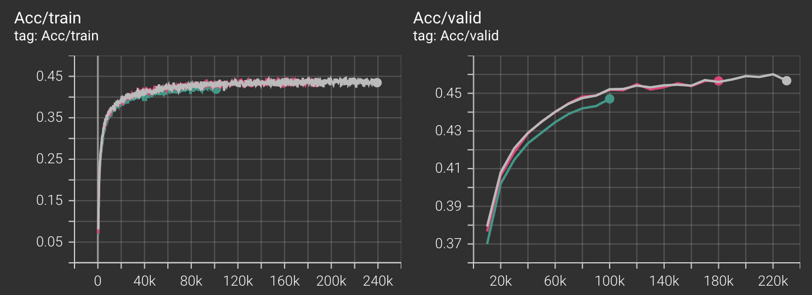

### case 7
 - description:
   - only en corpus
   - size of BPE vocab to 30k(size: 32458)
   - d_model-512, L2 weight decay $10^{-4}$ vs $10^{-5}$ vs $10^{-6}$
- date: 2023/05/17 09:50~2023/05/19 13:10
- directory: output/vocab30k_layer3, output/vocab30k_layer3_L2e-05, output/vocab30k_layer3_L2e-06
- params:
  > batch_size: 256  
learning_rate: $5*10^{-4}$  
weight_decay: $10^{-4}$ vs $10^{-5}$ vs $10^{-6}$  
d_model: 512  
h: 8  
ff: 2048  
n_layers: 3  
p_dropout: 0.1  
seq_len: 256  
- datasets: ko&en unified vocab (size: 32458) & only en dataset
  - trains: 1442176, steps per epoch: 5634 valids: 160242, steps per epoch: 626
- result: 
  - ___weight decay 1e-06 is best.___
  - red: $10^{-4}$, orange: $10^{-5}$, blue: $10^{-6}$ in below image.

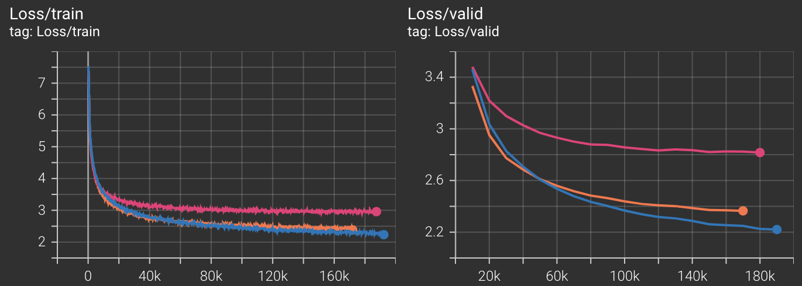

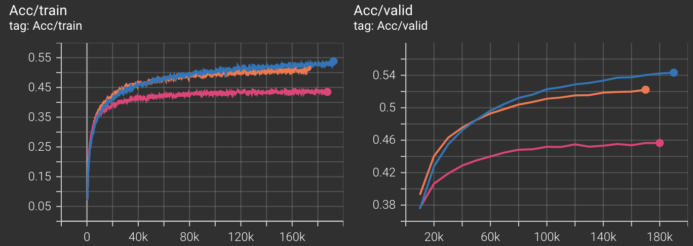

### case 8
 - description:
   - only en corpus
   - size of BPE vocab to 30000(size: 32458)
   - bpe token size 10k vs 20k vs 30k
- date: 2023/05/17 9:50~2023/05/20 21:15
- directory: output/vocab30k_layer3_L2e-05, output/v20k_layer3_L2e-05, output/v10k_layer3_L2e-05
- params:
  > batch_size: 256  
learning_rate: $5*10^{-4}$  
weight_decay: $10^{-5}$  
d_model: 512  
h: 8  
ff: 2048  
n_layers: 3  
p_dropout: 0.1  
seq_len: 256  
- datasets: ko&en unified vocab (size: 52458) & only en dataset
  - trains: 1442176, steps per epoch: 5634 valids: 160242, steps per epoch: 626
- result: 
  - ___the smaller the number of bpe tokens, the better the performance.___
  - blue: 10k, red: 20k, orange: 30k in below image.

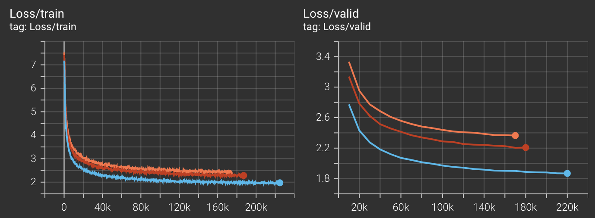

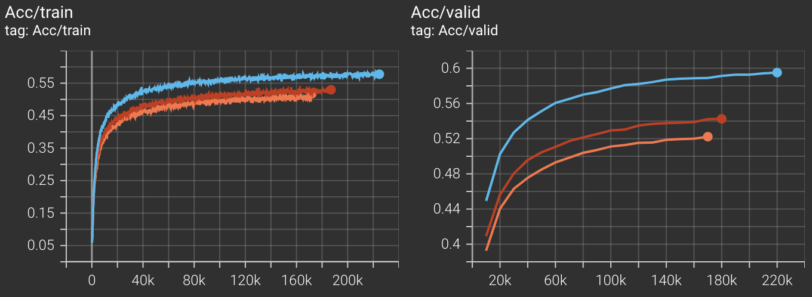

### case 9
 - description:
   - only en corpus
   - size of BPE vocab to 10k(size: 12458)
   - (lr:$5*10^{-4}$, weight decay:$10^{-5}$) vs  
    (lr:$5*10^{-3}$ , weight decay:$10^{-5}$) vs  
    (lr:$5*10^{-4}$, weight decay:$10^{-6}$) vs  
    (lr:$5*10^{-5}$ , weight decay:$10^{-6}$) vs 
- date: 2023/05/19 14:00~2023/05/22 10:10
- directory: output/v10k_layer3_L2e-05, output/v10k_layer3_L2e-06, output/v10k_layer3_lr5e-03, output/v10k_layer3_lr5e-05
- params:
  > batch_size: 256  
learning_rate: ... (on description)  
weight_decay: ... (on description)  
d_model: 512  
h: 8  
ff: 2048  
n_layers: 3  
p_dropout: 0.1  
seq_len: 256  
- datasets: ko&en unified vocab (size: 52458) & only en dataset
  - trains: 1442176, steps per epoch: 5634 valids: 160242, steps per epoch: 626
- result: 
  - lr $5*10^{-3}$ got underfitting.
  - L2 weight decay $10^{-6}$ is better than $10^{-5}$.
  - lr $5*10^{-5}$ score is getting better score slowly and steadily.
  - blue: 1, green: 2, pink: 3, gray: 4 in below image.

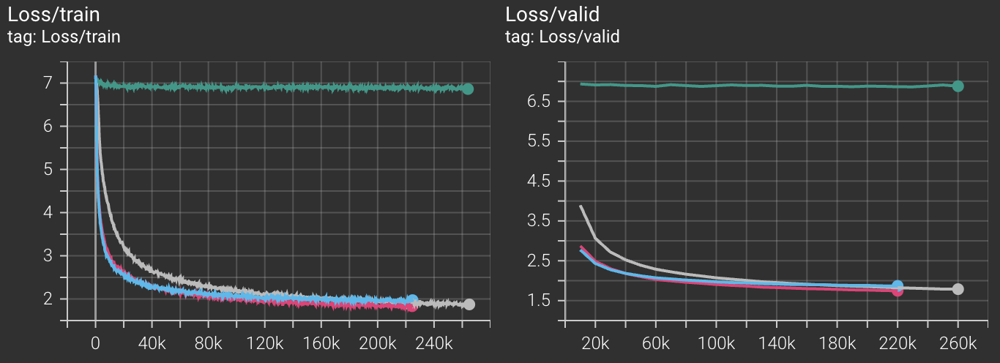

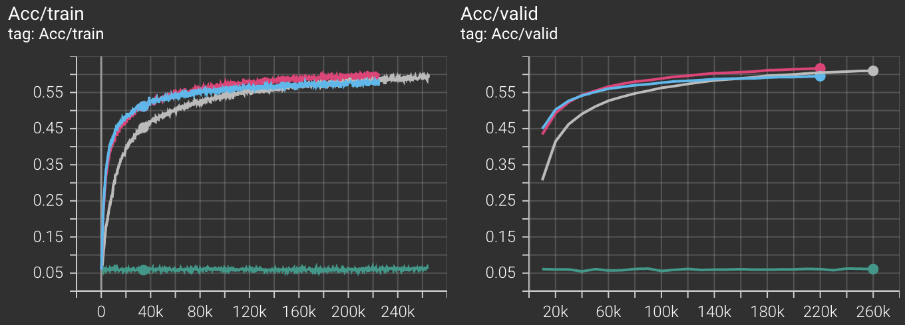

### case 10
 - description:
   - size of dataset 1/5
   - layer 6, weight decay 0, dropout 0
   - learning rate scheduler - warm up and exponential decay
   - compare learning rate
- date: 2023/05/23 18:45~2023/05/25 09:40
- directory: output/v5k_lr_e04, output/v5k_lr_e05
- dataset:
  - 1/5 of only en corpus
  - ko&en unified BPE vocab token 5k(size: 7458)
  - trains: 288435, steps per epoch: 1127 valids: 32048, steps per epoch: 126
- params:
  > batch_size: 256  
learning_rate: $5*10^{-4}$ vs $5*10^{-5}$  
weight_decay: 0  
d_model: 512  
h: 8  
ff: 2048  
n_layers: 6  
p_dropout: 0  
seq_len: 256  
- result: 
  - learning rate $5*10^{-4}$ is better.
  - red: $5*10^{-4}$, blue: $5*10^{-5}$ in below image.

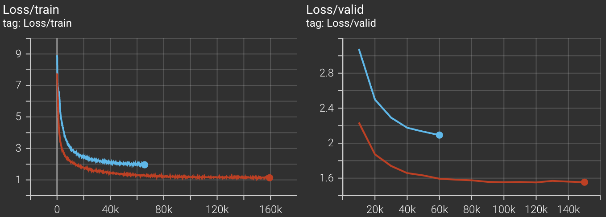

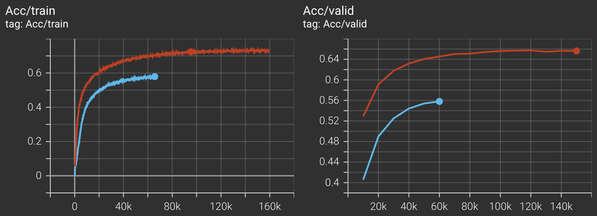

### case 11
 - description:
   - size of dataset 1/5
   - layer 6, weight decay 0, dropout 0
   - learning rate scheduler - warm up and exponential decay, cosine annealing
   - compare batch size 64, 128, 256 & lr scheduler
- date: 2023/05/23 18:45~2023/05/25 09:40
- directory: output/v5k_lr_e04, output/v5k_lr_e04_batch256, output/v5k_lr_e04_batch128, output/v5k_lr_e04_batch64
- dataset:
  - 1/5 of only en corpus
  - ko&en unified BPE vocab token 5k(size: 7458)
  - trains: 288435, steps per epoch: 1127 valids: 32048, steps per epoch: 126
- params:
  > batch_size: 64 vs 128 vs 256  
learning_rate: $5*10^{-4}$  
weight_decay: 0  
d_model: 512  
h: 8  
ff: 2048  
n_layers: 6  
p_dropout: 0  
seq_len: 256  
- result: 
  - batch 64 is bad at first, but it gradually becomes more like it.
  - waumupexp lr seems to be worst, changing gamma of warmupexp lr will be different results.
  - red: batch256&warmupexp lr, white: batch256&cosine annealing lr, orange: batch128&cosine annealing lr, blue: batch64&cosine annealing lr in below image.

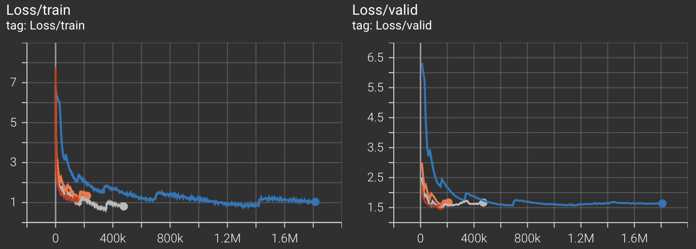

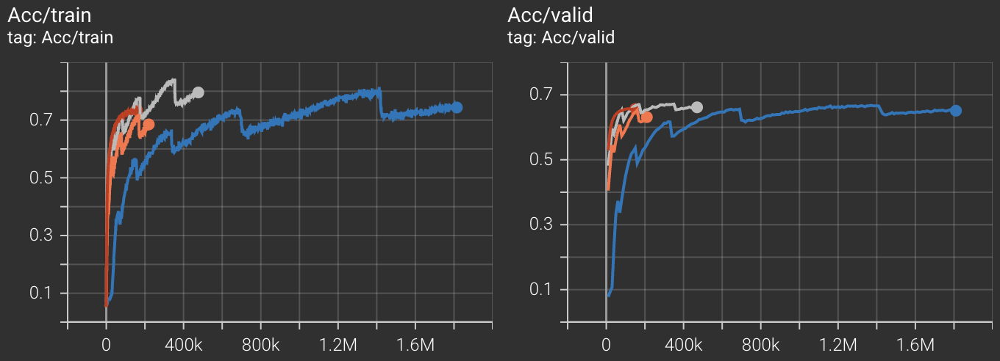

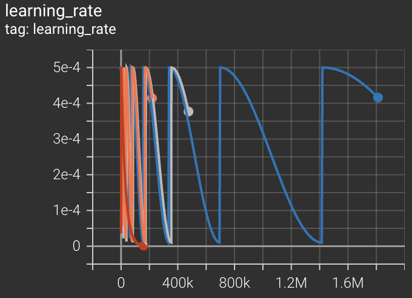

  - relative

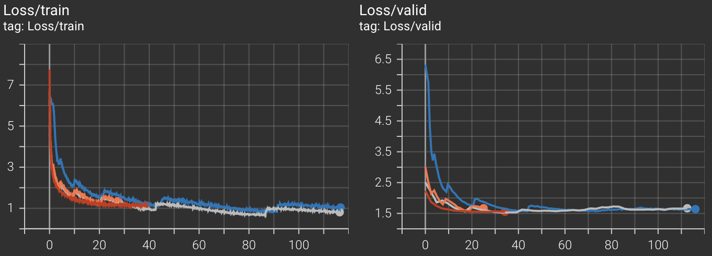

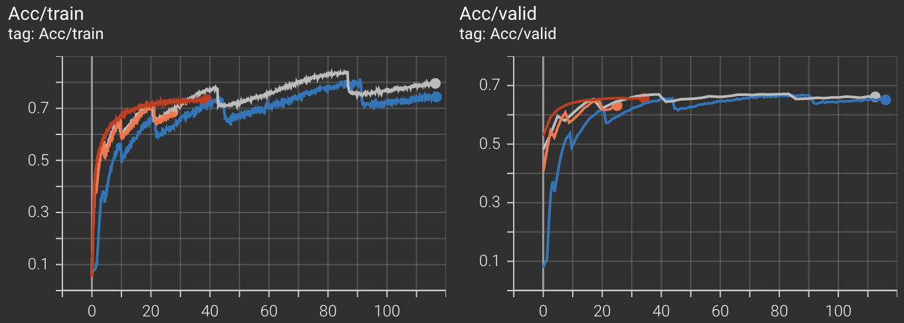

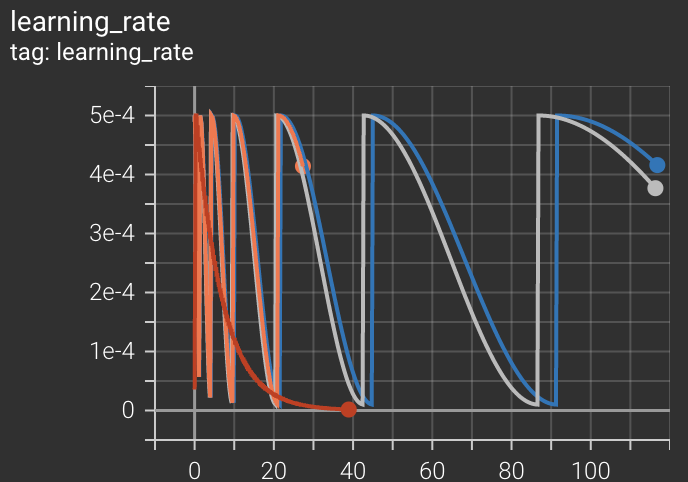

### case 12
 - description:
   - size of dataset 1/5
   - learning rate scheduler - cosine annealing
   - compare learning rate
- date: -
- directory: output/v5k_lr_e04_batch256, output/v5k_lr_e04_batch256_ccs2
- dataset:
  - 1/5 of only en corpus
  - ko&en unified BPE vocab token 5k(size: 7458)
  - trains: 288435, steps per epoch: 1127 valids: 32048, steps per epoch: 126
- params:
  > batch_size: 256  
learning_rate: $5*10^{-4}$ and decay 0 vs $1*10^{-3}$ and decay 0.75  
weight_decay: 0  
d_model: 512  
h: 8  
ff: 2048  
n_layers: 6  
p_dropout: 0  
seq_len: 256  
- result: 
  - higher lr is better in beginning. score gets worse as lr decrease.
  - red: $1*10^{-3}$ and decay 0.75 lr, white: $5*10^{-4}$ and decay 0

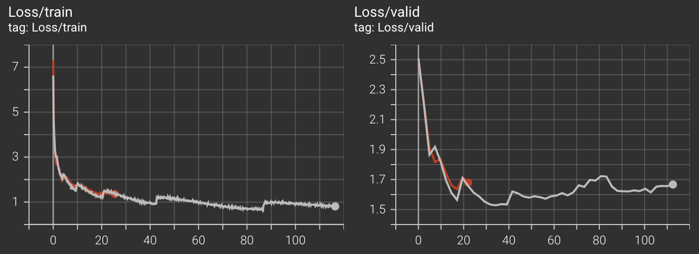

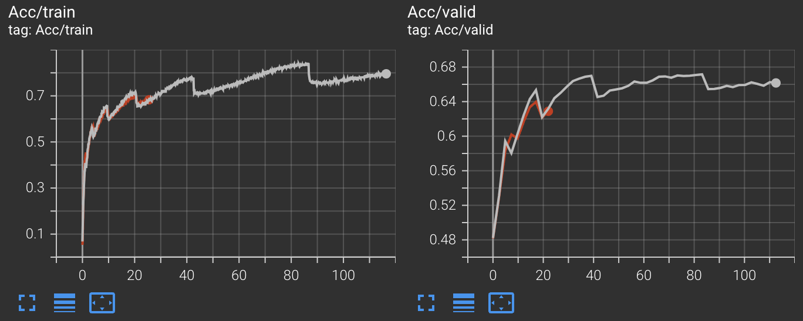

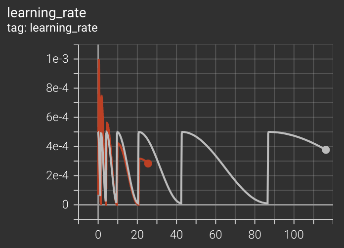

### case 13
 - description:
   - size of dataset 1/5
   - learning rate scheduler - cosine annealing
- date: -
- directory: v5k_batch128_lr12, v5k_batch64_lr12, v5k_bat128_lyr12_h4, v5k_bat128_lyr12_ff1024
- dataset:
  - 1/5 of only en corpus
  - ko&en unified BPE vocab token 5k(size: 7458)
  - trains: 288435, steps per epoch: 1127 valids: 32048, steps per epoch: 126
- params:
  > batch_size: 64 vs 128  
learning_rate: $5*10^{-4}$ and decay 0.95  
weight_decay: 0  
d_model: 512  
h: 8 vs 4  
ff: 2048 vs 1024  
n_layers: 12  
p_dropout: 0  
seq_len: 256  
- result: 
  - blue: batch128, h8, ff2048, red: batch 64 from blue lr, green: h4 from blue, white: ff1024 from blue
  - blue(batch128, h8, ff2048) is best.
  - layer 6 of case 12 is higher max acc score.

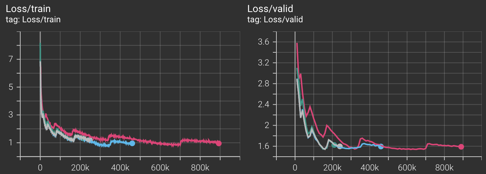

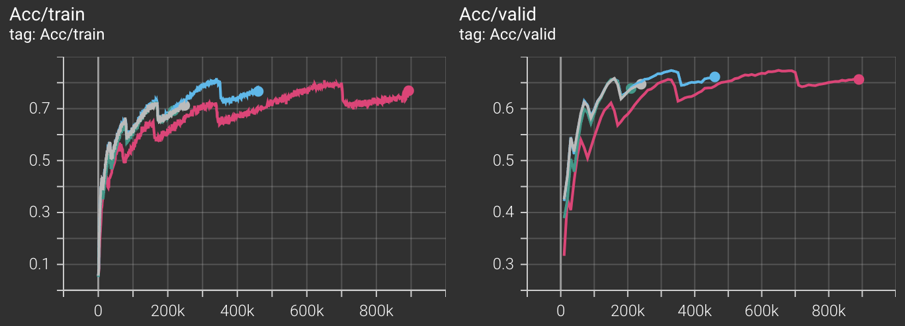

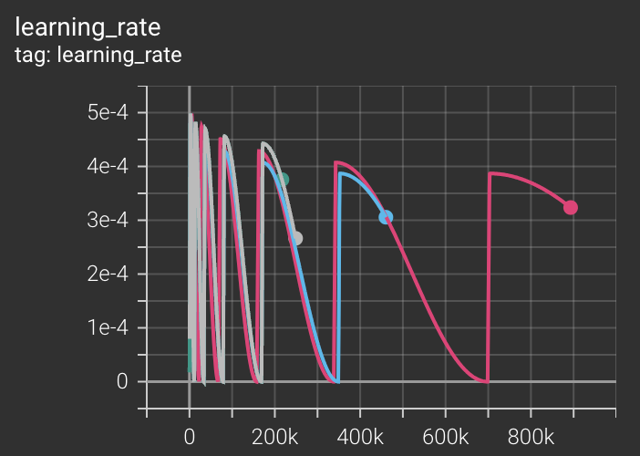

  - relative

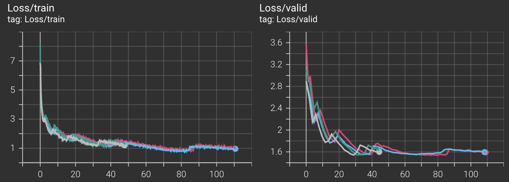

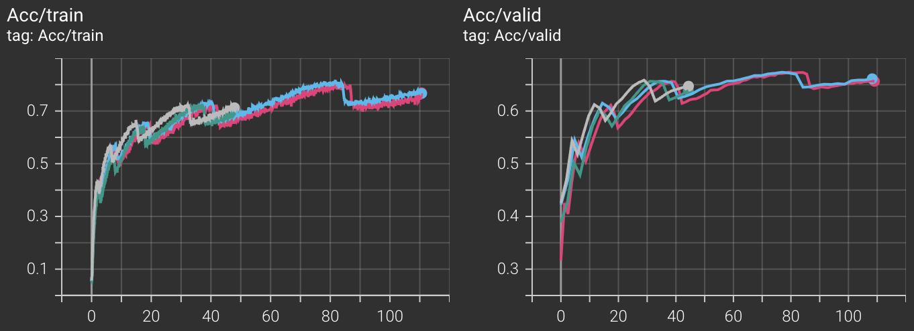

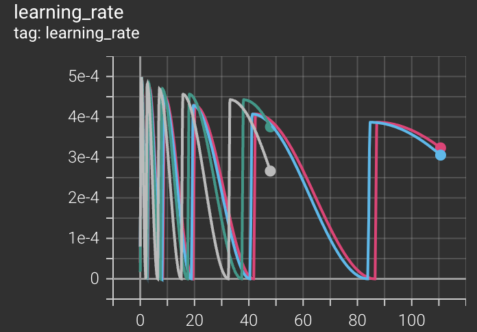

### case 14
 - description:
   - size of dataset 1/5
- date: -
- directory: v5k_bat128_d3072_h4_lyr3, v5k_bat128_d256_h8_lyr22, v5k_bat128_d1024_h4_lyr3, v5k_bat128_d1024_h8_lyr6
- dataset:
  - 1/5 of only en corpus
  - ko&en unified BPE vocab token 5k(size: 7458)
- params:
  > batch_size: 128  
learning_rate: $5*10^{-4}$ and (exponential decay) 0.99~0.97  
weight_decay: 0  
ff: 2048  
p_dropout: 0  
seq_len: 256  
- result: 
  - red: d3072, h4, lyr3, blue: d256, h8, lyr22, pink: d1024,h4,lyr3, green: d1024, h8, lyr6
  - blue is best, but d1024, h8, lyr6 is better.
  - pink and red is high lr.

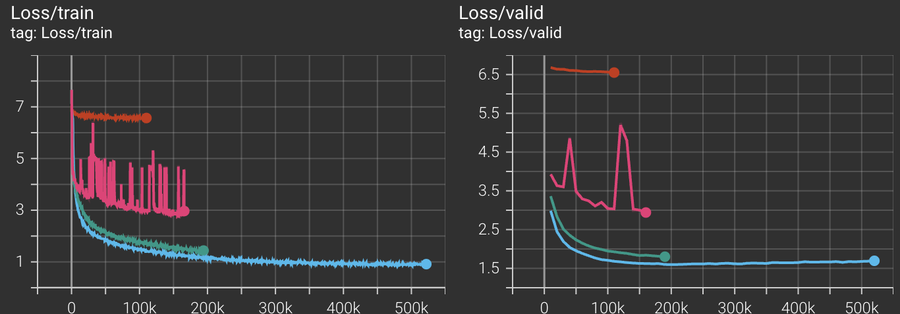

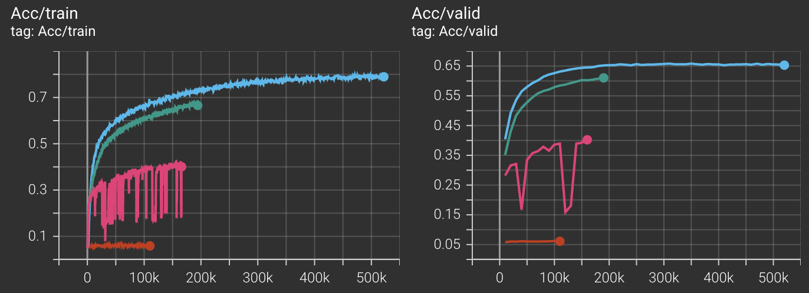

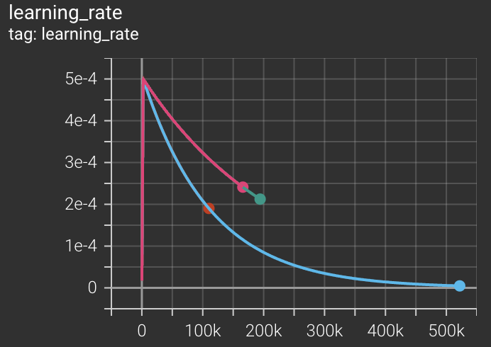

### case 15
 - description:
   - size of dataset 1/5
- date: -
- directory: v5k_bat64_d1024_h16_lyr16, v5k_bat64_d512_h8_lyr30, v5k_bat128_d1024_h8_lyr6_lr1e-4, v5k_bat64_d1024_h16_lyr16_lr5e-5, v5k_bat128_d1024_h8_lyr8_lr1e-4
- dataset:
  - 1/5 of only en corpus
  - ko&en unified BPE vocab token 5k(size: 7458)
- params:
  > batch_size: 128  
learning_rate: $5*10^{-4}$ and (exponential decay) 0.99~0.97  
weight_decay: 0  
ff: 2048  
p_dropout: 0  
seq_len: 256  
- result: 
  - case:
    - white: batch64, d1024, h16, lyr16
    - orange: batch64, d512, h8, lyr30
    - blue: batch128, d1024, h8, lyr6, lr1e-4
    - red: batch64, d1024, h16, lyr16, lr5e-5
    - sky: batch128, d1024, h8, lyr8, lr1e-4 
  - blue is best. sky has 2 more layers, but it is not better than blu.

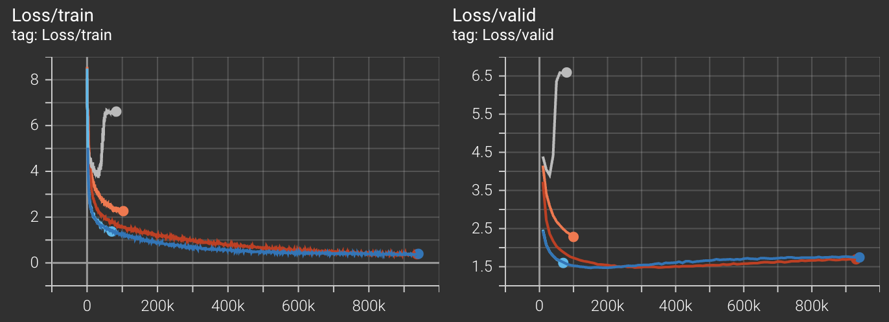

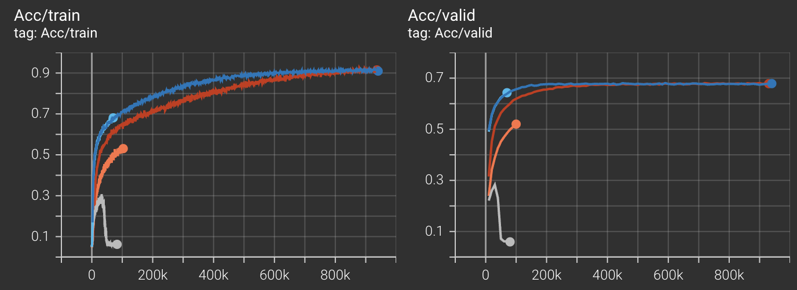

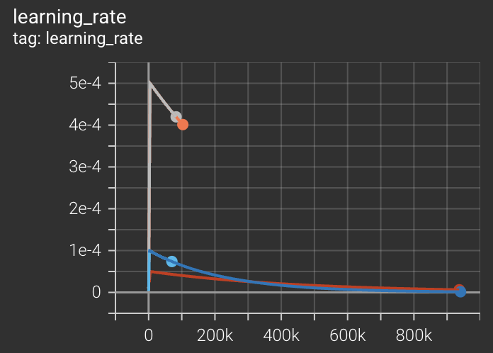

### case 16
 - description:
   - size of dataset 1/5 and full
- date: -
- directory: v5k_bat128_d1024_h8_lyr6_lr1e-4_L21e-5,dr0.1 , v5k_bat128_d1024_h8_lyr6_lr1e-4_L21e-6,dr0.1, v5k_bat128_d1024_h8_lyr6_lr1e-4_full
- dataset:
  - 1/5 of only en corpus and full
  - ko&en unified BPE vocab token 5k(size: 7458)
- params:
  > batch_size: 128  
learning_rate: $1*10^{-4}$ and (exponential decay) 0.99~0.97  
weight_decay: $1*10^{-5}$ vs $1*10^{-6}$  
d_model: 1024  
h: 8  
ff: 2048  
layer: 6
p_dropout: 0.1  
seq_len: 256  
- result: 
  - case:
    - pink: l2 weight decay $1*10^{-5}$
    - gray: l2 weight decay $1*10^{-6}$
    - green: l2 weight decay 0, dropout 0, full dataset corpus
    - blue: same as blue in case 15
  - train acc/loss got worse, valid acc/valid got better in regularization.
  - training full corpus got score like giving regularization.

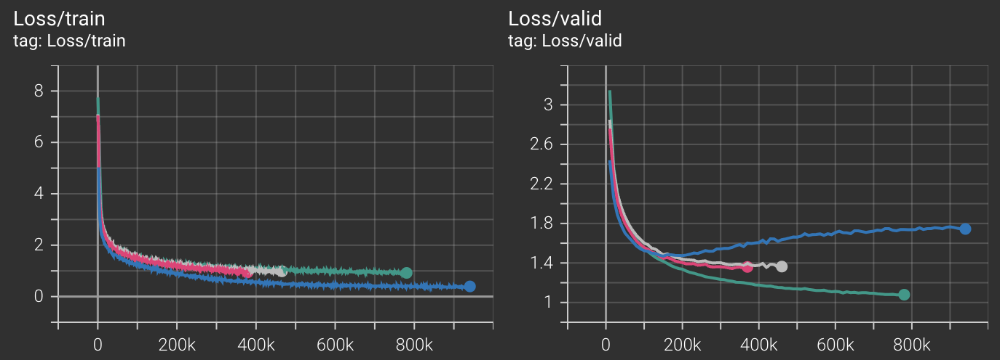

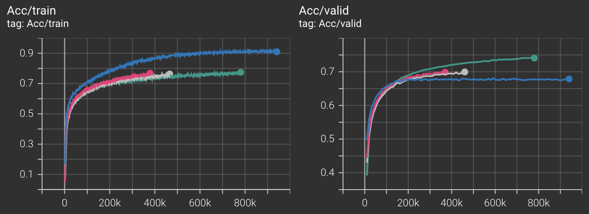

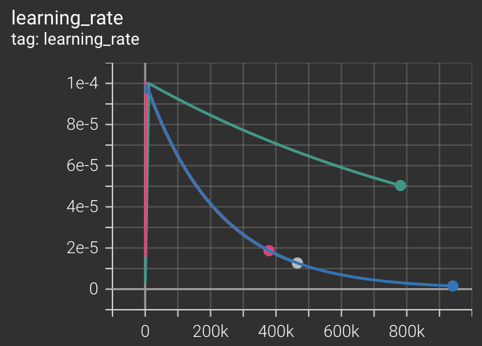

### case 17
 - description:
   - 
- date: -
- directory: v5k_bat128_d1024_h8_lyr12_lr1e-4_full, v5k_bat256_d1024_h8_lyr6_lr1e-4_full, v5k_bat256_d1024_h8_lyr6_lr5e-4_full, v5k_bat256_d1024_h8_lyr6_lr2e-4_full
- dataset:
  - full only en corpus
  - ko&en unified BPE vocab token 5k(size: 7458)
- params:
  >  
learning_rate: (warm exponential decay) 0.99  
weight_decay: 0  
d_model: 1024  
h: 8  
ff: 2048  
p_dropout: 0.0  
seq_len: 256  
- result: 
  - case:
    - orange: batch 128, lyr 12, lr $1*10^{-4}$
    - blue: batch 256, lyr 6, lr $1*10^{-4}$
    - red: batch 256, lyr 6, lr $5*10^{-4}$
    - sky: batch 256, lyr 6, lr $2*10^{-4}$
  - blue got best score.

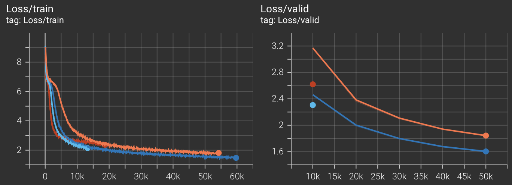

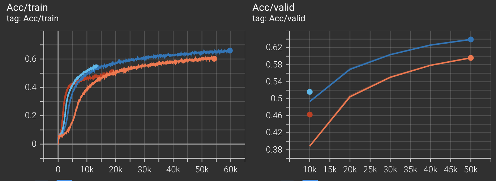

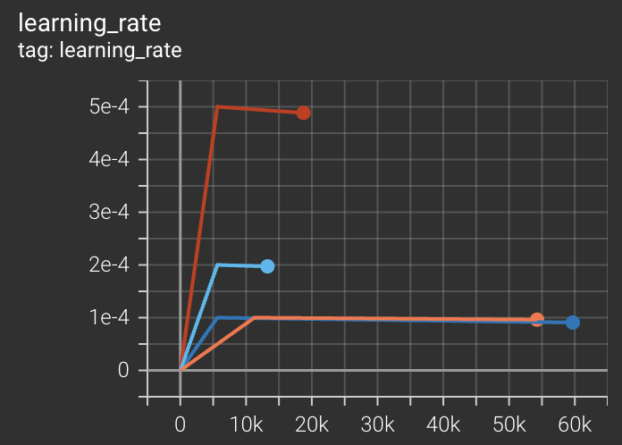

### case 18
 - description:
   - use swish activation function
- date: -
- directory: v5k_bat128_d1024_h8_lyr6_lr1e-4_full_swish
- dataset:
  - full only en corpus
  - ko&en unified BPE vocab token 5k(size: 7458)
- params:
  >  batch_size: 128
learning_rate: $1*10^{-4}$ (warm exponential decay) 0.99  
weight_decay: 0  
d_model: 1024
h: 8
ff: 2048
layers: 6
p_dropout: 0.0  
seq_len: 256  
- result: 
  - case:
    - pink: swish
    - green: relu

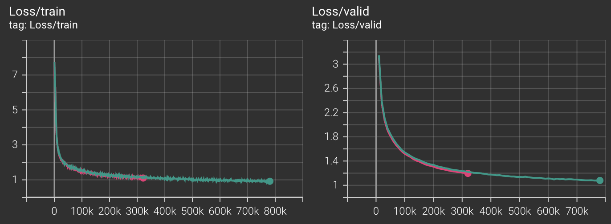

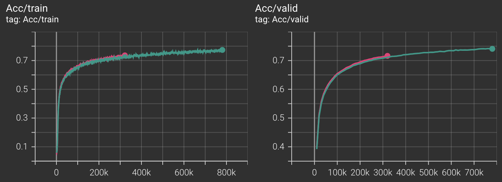

### case 19
 - description:
   - 
- date: -
- directory: v5k_bat128_d2048_h16_lyr6_lr1e-4_full, v5k_bat128_d1024_h8_lyr6_lr1e-4_full_ff3072, v5k_bat128_d1536_h12_lyr6_lr1e-4_ff3072_full, v5k_bat128_d1024_h16_lyr6_lr5e-5_ff3072_full
- dataset:
  - full only en corpus
  - ko&en unified BPE vocab token 5k(size: 7458)
- params:
  >  
learning_rate: (warm exponential decay) 0.99  
weight_decay: 0  
layers: 6
p_dropout: 0.0  
seq_len: 256  
- result: 
  - case:
    - green: d 2048, h16, ff2048, lr $1*10^{-4}$
    - blue: d 1024, h8, ff3072, lr $1*10^{-4}$
    - red: d 1536, h12, ff3072, lr $1*10^{-4}$
    - pink: d 1024, h16, ff3072, lr $5*10^{-5}$
  - red got best score. but blue in case 17 is better.

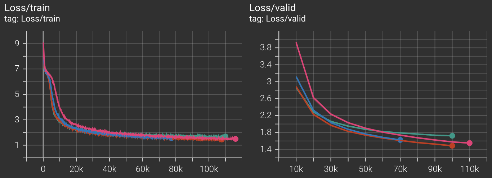

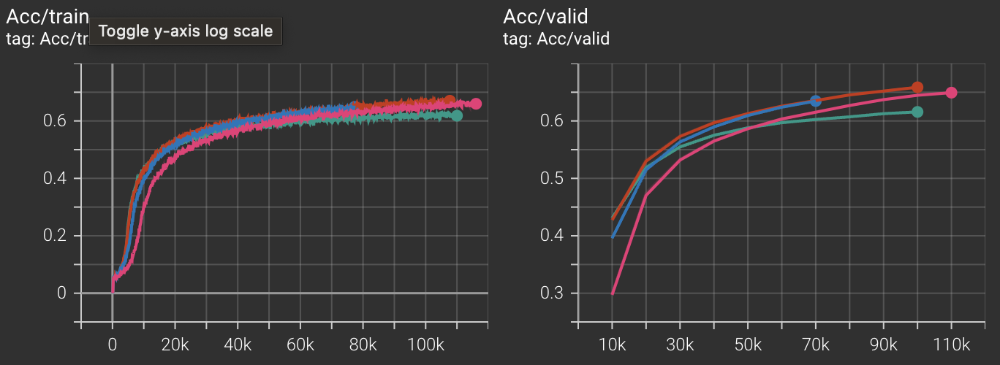

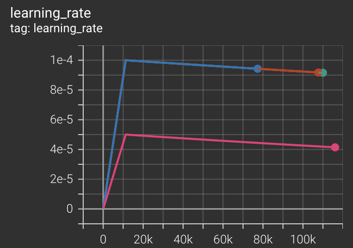

### case 20
 - description:
   - compare dynamic masking vs static masking, torch compiled model vs not compiled model
- date: -
- directory: v5k_bat128_d1024_h8_lyr6_lr1e-4_full_staticmasked, v5k_bat128_d1024_h8_lyr6_ff2048_lr1e-4_full_nocomp
- dataset:
  - full only en corpus
  - ko&en unified BPE vocab token 5k(size: 7458)
- params:
  > batch size: 128  
learning_rate: $1*10^{-4}$ (warm exponential decay) 0.99  
weight_decay: 0  
d_model: 1024
h: 8
ff: 2048
layers: 6
p_dropout: 0.0  
seq_len: 256  
- result: 
  - case:
    - green: static masking
    - blue: dynamic masking, compiled model
    - white: not compiled model
  - static masking and not compiled model didn't get better score.

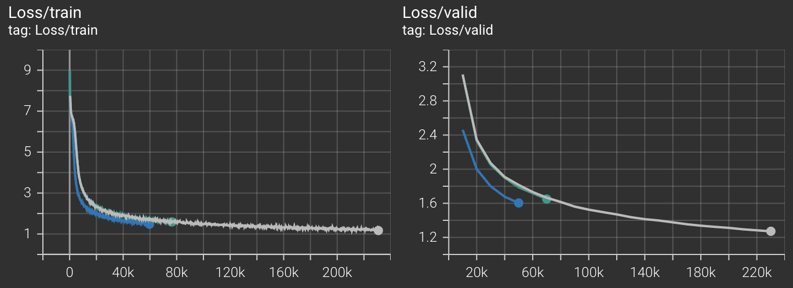

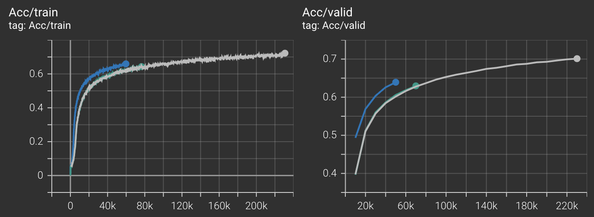

### case 21
 - description:
   - compare implemented encoder module and torch nn encoder module.
   - compare embedding layer and linear transform in output layer.
- date: -
- directory: v5k_bat128_d1024_h8_lyr6_ff2048_lr1e-4decay0.9_torchmodule_full_lin, v5k_bat128_d1024_h8_lyr6_ff2048_lr1e-4decay0.95_full_lin
- dataset:
  - full only en corpus
  - ko&en unified BPE vocab token 5k(size: 7458)
- params:
  >  batch size: 128  
learning_rate: $1*10^{-4}$ (warm exponential decay) 0.99  
weight_decay: 0  
d_model: 1024
h: 8
ff: 2048
layers: 6
p_dropout: 0.0  
seq_len: 256  
- result: 
  - case:
    - white: use torch nn.TransformerEncoder(nn.TransformerEncoderLayer())
    - orange: use linear transform instead of embedding in output layer.
    - read: use implemented encoder module and embedding in output layer.
  - using torch encoder is better slightly.

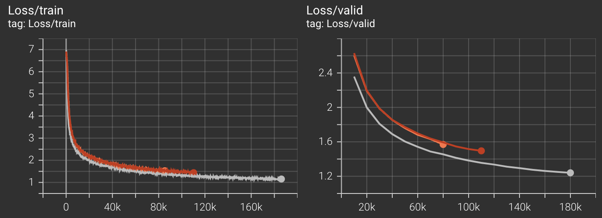

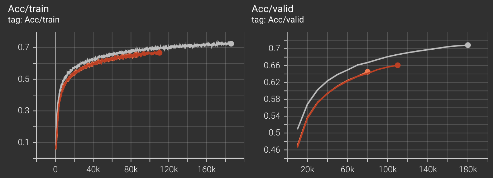

### case 22
 - description:
   - using dataset corpus only news domain 800k
- date: -
- directory: v5k_bat128_d1024_h8_lyr9_ff2048_lr1e-4decay0.9_news_fixed
- dataset:
  - 800k only en & only news domain corpus
  - ko&en unified BPE vocab token 5k(size: 7458)
- params:
  >  batch size: 128  
learning_rate: $1*10^{-4}$ (warm exponential decay) 0.99  
weight_decay: 0  
d_model: 1024
h: 8
ff: 2048
layers: 9
p_dropout: 0.0  
seq_len: 256  
- result: 
  - case:
    - red: dataset corpus only news 800k
    - sky: full dataset

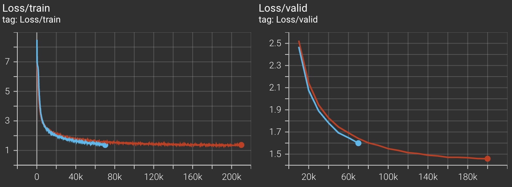

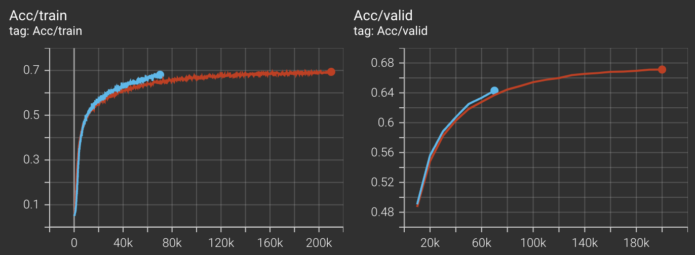

### case 23
 - description:
   - fix a bug that text and label in dataloader does not match(https://github.com/dhchoi-hs/transformer_pytorch/commit/717c64529d0eeb42b8736404718fffc682b84cf5)
- date: -
- directory: v5k_bat128_d1024_h8_lyr6_ff2048_lr1e-4decay0.9_newloader
- dataset:
  - full only en corpus
  - ko&en unified BPE vocab token 5k(size: 7458)
- params:
  >  batch size: 128  
learning_rate: $1*10^{-4}$ (warm exponential decay) 0.99  
weight_decay: 0  
d_model: 1024
h: 8
ff: 2048
layers: 6
p_dropout: 0.0  
seq_len: 256  
- result: 
  - case:
    - pink: fixed bug

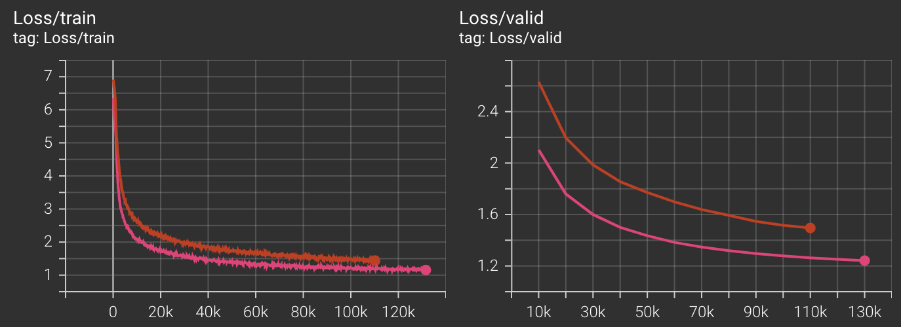

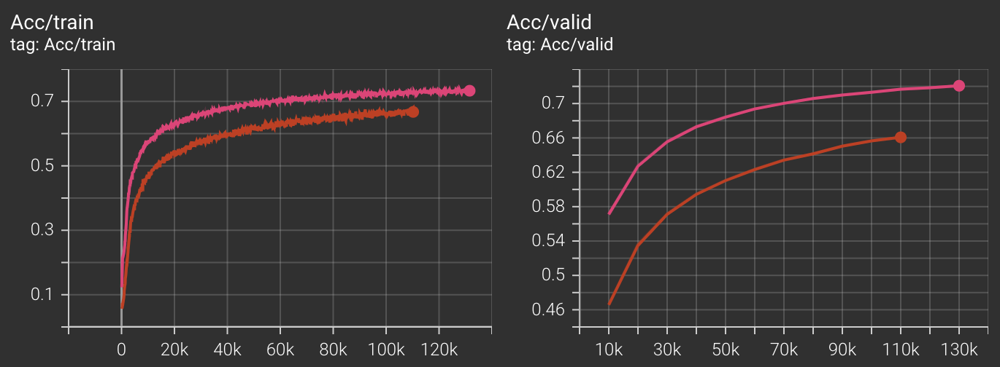

### case 24
 - description:
   - difference vocab size 5k, 10k, 20k
- date: -
- directory: v10k_bat128_d1024_h8_lyr6_ff2048_lr1e-4decay0.85_only_en_vocab, v20k_bat128_d1024_h8_lyr6_ff2048_lr1e-4decay0.85_only_en_vocab
- dataset:
  - full only en corpus
  - ko&en unified BPE vocab token 5k(size: 7458) and only en BPE vocab token 10k, 20k
- params:
  >  batch size: 128  
learning_rate: $1*10^{-4}$ (warm exponential decay) 0.99  
weight_decay: 0  
d_model: 1024
h: 8
ff: 2048
layers: 6
p_dropout: 0.0  
seq_len: 256  
- result: 
  - case:
    - orange: vocab 10k
    - blue: vocab 20k
    - pink: vocab 5k
  - the larger vocab size, the worse score

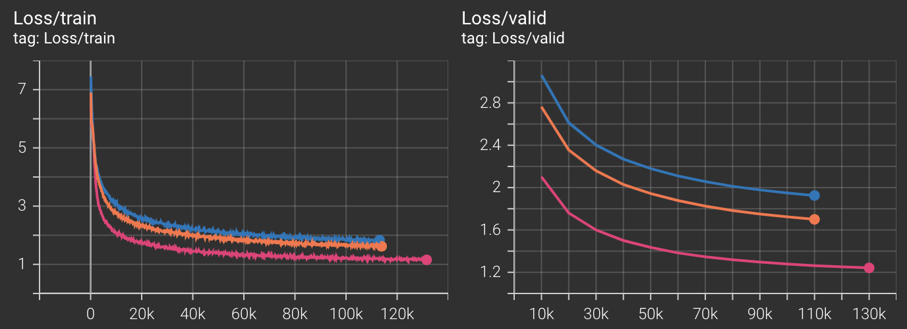

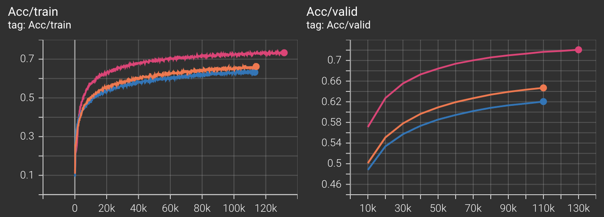

### case 25
 - description:
   - use lr scheduler - cosine annealing warm restart
- date: -
- directory: v5k_bat128_d1024_h8_lyr6_ff2048_lr2e-4dcosinelr, v5k_bat128_d1024_h8_lyr6_ff2048_lr2e-4coslr_dropout0.1_l21e-5
- dataset:
  - full only en corpus
  - ko&en unified BPE vocab token 5k(size: 7458)
- params:
  >  batch size: 128  
learning_rate: $2*10^{-4}$ (cosine annealing warm restart decay-  T_0: 15, T_mult: 1, eta_min: 5.0e-6)  
d_model: 1024
h: 8
ff: 2048
layers: 6
seq_len: 256  
- result: 
  - case:
    - **white: dropout 0, L2 weight decay 0** (best model)
    - red: dropout 0.1, L2 weight decay 1e-5
    - pink: exponential lr decay, no regularization

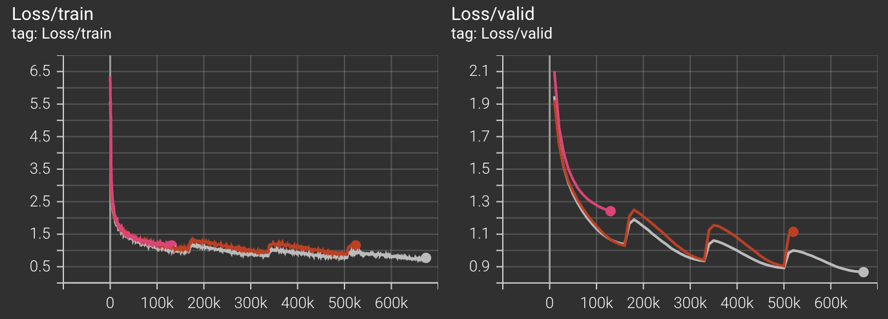

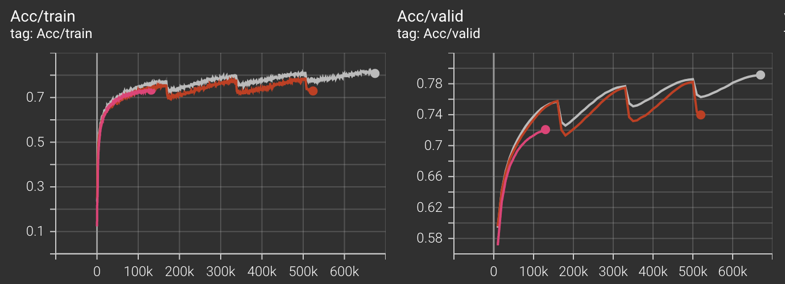

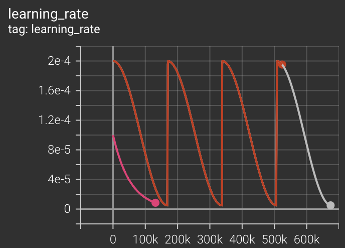

