# Training record
- Record of training model that only encoder stack like BERT.

## Training case
### case 1
- description: training model layer 4 and 6
- date: 2023/04/28 20:00~2023/05/02 17:40
- directory: output/model_20230428182127_1, output/model_20230428182728_1
- params:
  > batch_size: 256  
learning_rate: $5*10^{-4}$  
weight_decay: 0  
d_model: 512  
h: 8  
ff: 2048  
n_layers: 4 and 6  
p_dropout: 0.1  
seq_len: 256  
- datasets: ko&en unified vocab (size: 52458) & dataset
  - trains: 2884352, steps per epoch: 11267 valids: 320484, steps per epoch: 1252
- result: 
  - ___training loss decreases, valid loss increases. overfitting___
  - blue is layer 6, orange is layer 4 in below image
  - (logging iteration with epoch, not step.)

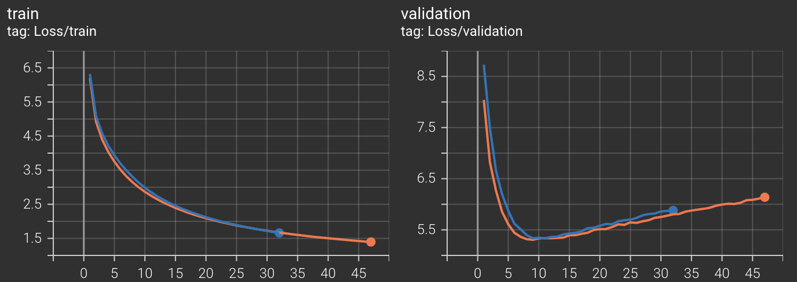

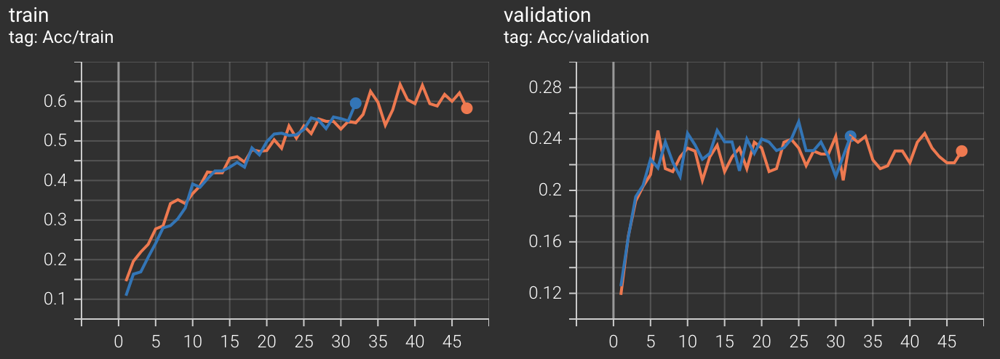

### case 2
- description: apply L2 weight decay 0.01 to case 1.
- date: 2023/05/04 20:20~2023/05/08 09:30
- directory: output/model_20230504181935_2, output/model_20230504181938_2
- params:
  > batch_size: 256  
learning_rate: $5*10^{-4}$  
weight_decay: 0.01  
d_model: 512  
h: 8  
ff: 2048  
n_layers: 4 and 6  
p_dropout: 0.1  
seq_len: 256  
- datasets: ko&en unified vocab (size: 52458) & dataset
  - trains: 2884352, steps per epoch: 11267 valids: 320484, steps per epoch: 1252
- result: 
  - ___underfitting. weight decay is too high.___
  - blue is layer 6, orange is layer 4 in below image
  - (logging iteration with epoch, not step.)

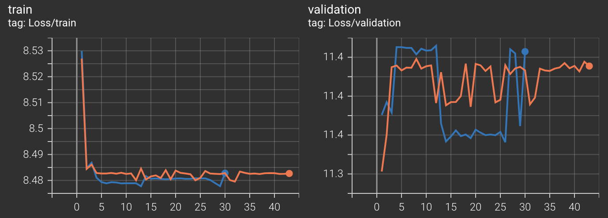

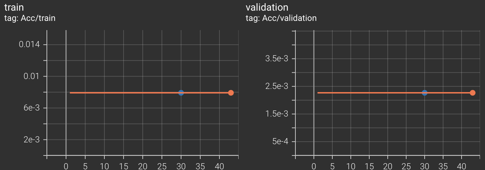

### case 3
- description: 
  - lower weight decay 0.001 to case 2
  - d_model 512 to 768
  - iteration with step.
- date: 2023/05/10 18:00~2023/05/11 10:30
- directory: output/model_20230510175614_3, output/model_20230510180434_3
- params:
  > batch_size: 256  
learning_rate: $5*10^{-4}$  
weight_decay: 0.001  
d_model: 768 and 512  
h: 8  
ff: 2048  
n_layers: 3 and 6  
p_dropout: 0.1  
seq_len: 256  
- datasets: ko&en unified vocab (size: 52458) & dataset
  - trains: 2884352, steps per epoch: 11267 valids: 320484, steps per epoch: 1252
- result: 
  - ___different scores depending on the dataset. english corpus get better score than korean corpus.___
  - blue is layer 6, orange is layer 3 in below image

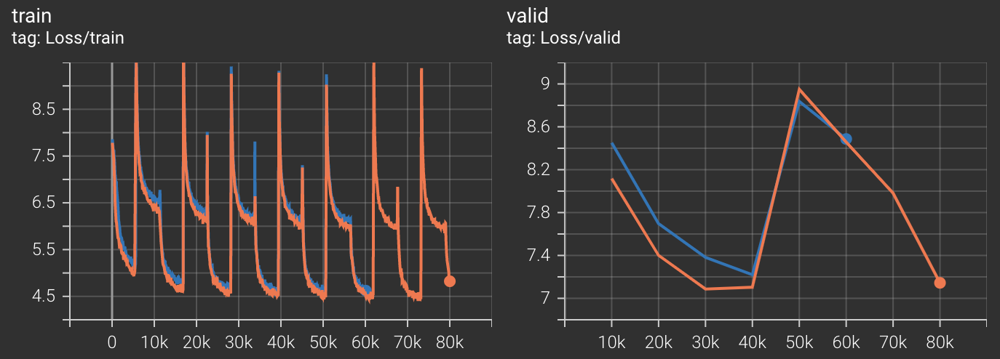

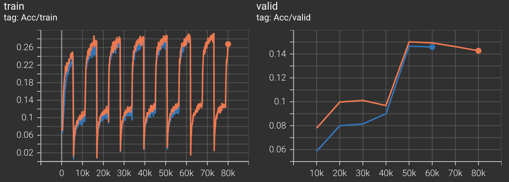

### case 4.
- description:
  - dataset corpus only ko
  - fixed mask token position on every epoch vs dynamic mask token position on every epoch
- date: 2023/05/10 18:00~2023/05/11 10:30
- directory: output/model_20230511161405_4, output/model_20230511185250_4
- params:
  > batch_size: 256  
learning_rate: $5*10^{-4}$  
weight_decay: 0.001  
d_model: 768  
h: 8  
ff: 2048  
n_layers: 3  
p_dropout: 0.1  
seq_len: 256  
- datasets: ko&en unified vocab (size: 52458) & only ko dataset
  - trains: 1442176, steps per epoch: 5634 valids: 160242, steps per epoch: 626
- result: 
  - ___fixed mask token getting better scores slightly than dynamic mask token.___
  - blue is dynamic mask token, orange is fixed mask token in below image.

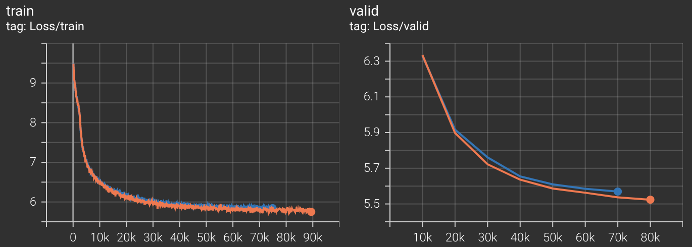

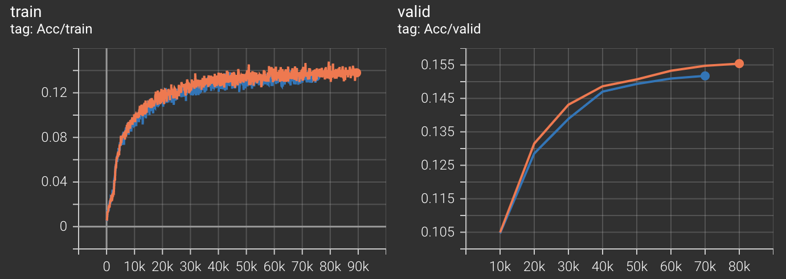

### case 5
- description: 
  - only en
  - weight decay $10^{-3}$ vs $10^{-4}$
- date: 2023/05/12 18:25~2023/05/15 09:25
- directory: output/only_en_L2e-03_5, output/only_en_L2e-04_5
- params:
  > batch_size: 256  
learning_rate: $5*10^{-4}$  
weight_decay: $10^{-3}$ and $10^{-4}$  
d_model: 768  
h: 8  
ff: 2048  
n_layers: 3  
p_dropout: 0.1  
seq_len: 256  
- datasets: ko&en unified vocab (size: 52458) & only en dataset
  - trains: 1442176, steps per epoch: 5634 valids: 160242, steps per epoch: 626
- result: 
  - ___weight decay 0.0001 got better score.___
  - blue is weight decay 0.0001, orange is weight dacy 0.001 in below image.

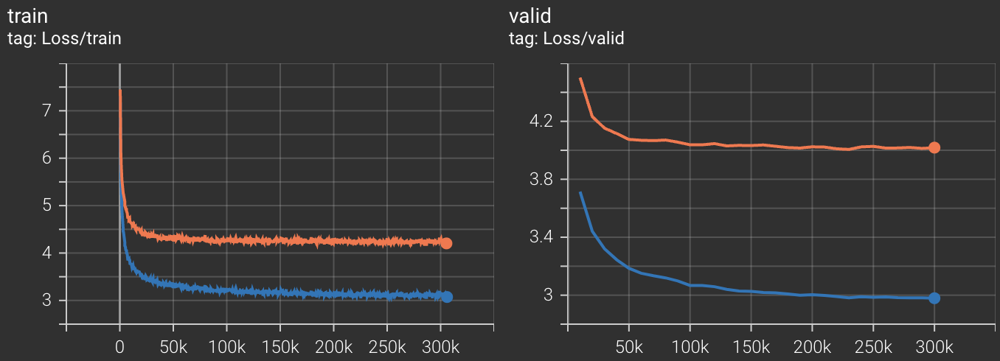

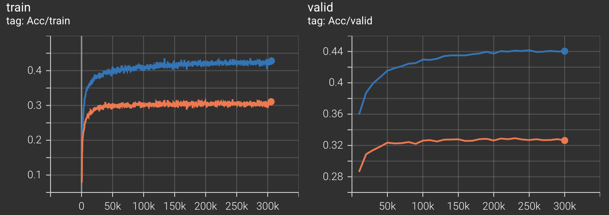

### case 6
 - description:
   - only en corpus
   - size of BPE vocab to 30000(size: 32458)
   - d_model-512, layer 2 vs 3 vs 6
- date: 2023/05/15 15:00~2023/05/16 17:10, 2023/05/17 09:00~2023/05/18 09:50
- directory: output/vocab30k_layer2, output/vocab30k_layer3, output/vocab30k_layer6
- params:
  > batch_size: 256  
learning_rate: $5*10^{-4}$  
weight_decay: $10^{-4}$  
d_model: 512  
h: 8  
ff: 2048  
n_layers: __2__ and __3__ and __6__  
p_dropout: 0.1  
seq_len: 256  
- datasets: ko&en _unified_ vocab (size: 32458) & only en dataset
  - trains: 1442176, steps per epoch: 5634 valids: 160242, steps per epoch: 626
- result: 
  - ___layer 6 is worst. Layers 2 and 3 are not significantly different.___
  - gray: layer2, pink: layer 3, green: layer 6 in below image.

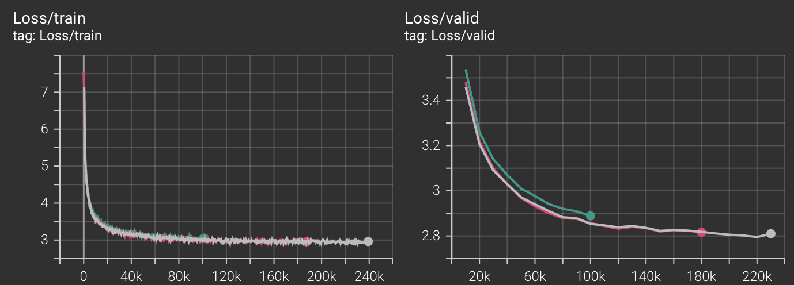

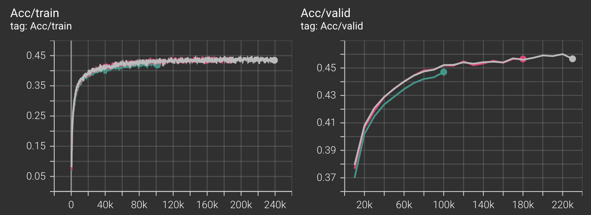

### case 7
 - description:
   - only en corpus
   - size of BPE vocab to 30k(size: 32458)
   - d_model-512, L2 weight decay $10^{-4}$ vs $10^{-5}$ vs $10^{-6}$
- date: 2023/05/17 09:50~2023/05/19 13:10
- directory: output/vocab30k_layer3, output/vocab30k_layer3_L2e-05, output/vocab30k_layer3_L2e-06
- params:
  > batch_size: 256  
learning_rate: $5*10^{-4}$  
weight_decay: $10^{-4}$ vs $10^{-5}$ vs $10^{-6}$  
d_model: 512  
h: 8  
ff: 2048  
n_layers: 3  
p_dropout: 0.1  
seq_len: 256  
- datasets: ko&en unified vocab (size: 32458) & only en dataset
  - trains: 1442176, steps per epoch: 5634 valids: 160242, steps per epoch: 626
- result: 
  - ___weight decay 1e-06 is best.___
  - red: $10^{-4}$, orange: $10^{-5}$, blue: $10^{-6}$ in below image.

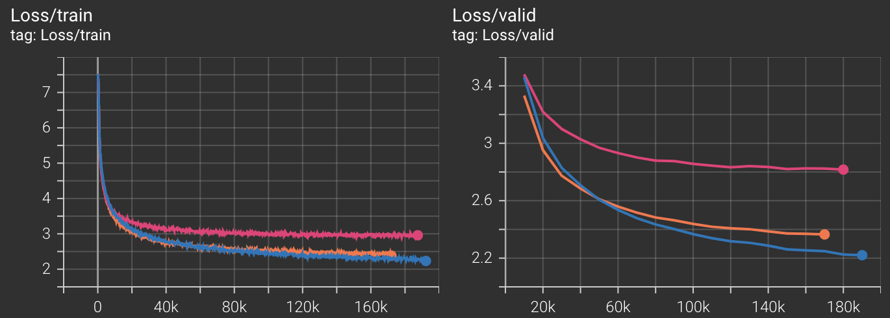

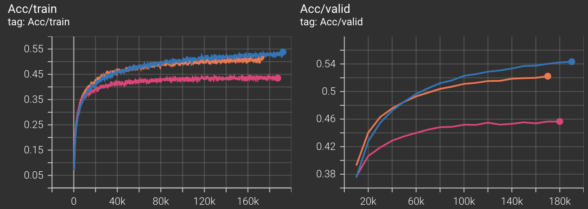

### case 8
 - description:
   - only en corpus
   - size of BPE vocab to 30000(size: 32458)
   - bpe token size 10k vs 20k vs 30k
- date: 2023/05/17 9:50~2023/05/20 21:15
- directory: output/vocab30k_layer3_L2e-05, output/v20k_layer3_L2e-05, output/v10k_layer3_L2e-05
- params:
  > batch_size: 256  
learning_rate: $5*10^{-4}$  
weight_decay: $10^{-5}$  
d_model: 512  
h: 8  
ff: 2048  
n_layers: 3  
p_dropout: 0.1  
seq_len: 256  
- datasets: ko&en unified vocab (size: 52458) & only en dataset
  - trains: 1442176, steps per epoch: 5634 valids: 160242, steps per epoch: 626
- result: 
  - ___the smaller the number of bpe tokens, the better the performance.___
  - blue: 10k, red: 20k, orange: 30k in below image.

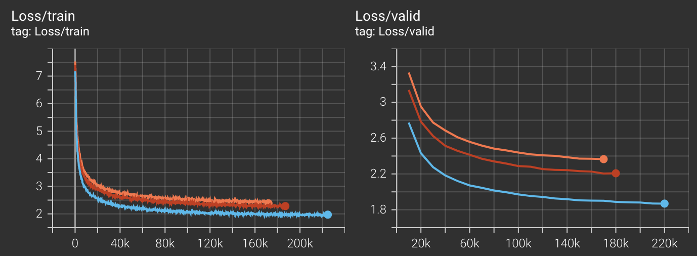

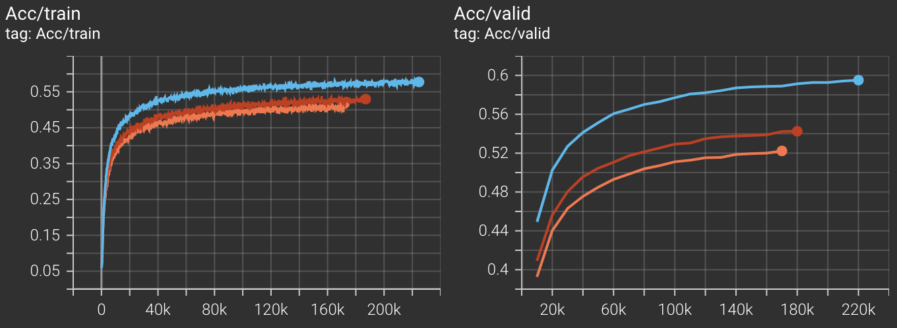

### case 9
 - description:
   - only en corpus
   - size of BPE vocab to 10k(size: 12458)
   - (lr:$5*10^{-4}$, weight decay:$10^{-5}$) vs  
    (lr:$5*10^{-3}$ , weight decay:$10^{-5}$) vs  
    (lr:$5*10^{-4}$, weight decay:$10^{-6}$) vs  
    (lr:$5*10^{-5}$ , weight decay:$10^{-6}$) vs 
- date: 2023/05/19 14:00~2023/05/22 10:10
- directory: output/v10k_layer3_L2e-05, output/v10k_layer3_L2e-06, output/v10k_layer3_lr5e-03, output/v10k_layer3_lr5e-05
- params:
  > batch_size: 256  
learning_rate: ... (on description)  
weight_decay: ... (on description)  
d_model: 512  
h: 8  
ff: 2048  
n_layers: 3  
p_dropout: 0.1  
seq_len: 256  
- datasets: ko&en unified vocab (size: 52458) & only en dataset
  - trains: 1442176, steps per epoch: 5634 valids: 160242, steps per epoch: 626
- result: 
  - lr $5*10^{-3}$ got underfitting.
  - L2 weight decay $10^{-6}$ is better than $10^{-5}$.
  - lr $5*10^{-5}$ score is getting better score slowly and steadily.
  - blue: 1, green: 2, pink: 3, gray: 4 in below image.

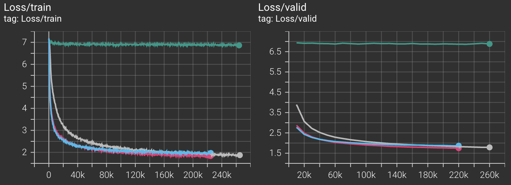

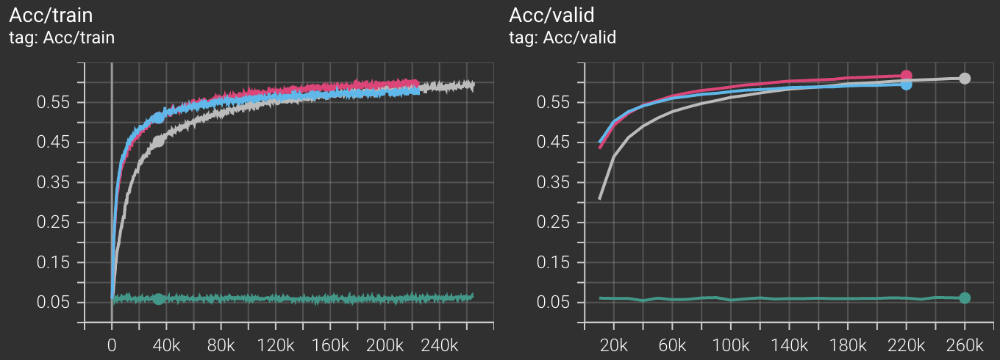

### case 10
 - description:
   - size of dataset 1/5
   - layer 6, weight decay 0, dropout 0
   - learning rate scheduler - warm up and exponential decay
   - compare learning rate
- date: 2023/05/23 18:45~2023/05/25 09:40
- directory: output/v5k_lr_e04, output/v5k_lr_e05
- dataset:
  - 1/5 of only en corpus
  - ko&en unified BPE vocab token 5k(size: 7458)
  - trains: 288435, steps per epoch: 1127 valids: 32048, steps per epoch: 126
- params:
  > batch_size: 256  
learning_rate: $5*10^{-4}$ vs $5*10^{-5}$  
weight_decay: 0  
d_model: 512  
h: 8  
ff: 2048  
n_layers: 6  
p_dropout: 0  
seq_len: 256  
- result: 
  - learning rate $5*10^{-4}$ is better.
  - red: $5*10^{-4}$, blue: $5*10^{-5}$ in below image.

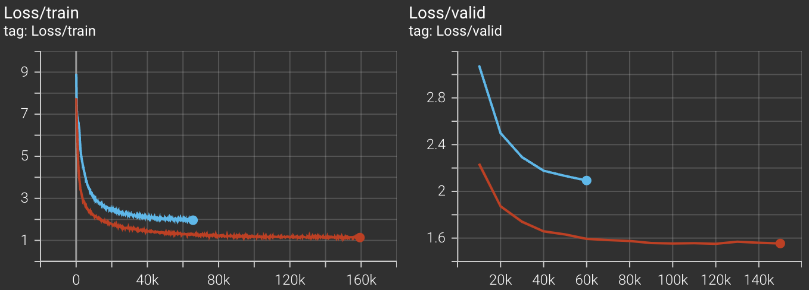

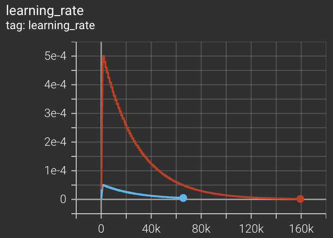

### case 11
 - description:
   - size of dataset 1/5
   - layer 6, weight decay 0, dropout 0
   - learning rate scheduler - warm up and exponential decay, cosine annealing
   - compare batch size 64, 128, 256 & lr scheduler
- date: 2023/05/23 18:45~2023/05/25 09:40
- directory: output/v5k_lr_e04, output/v5k_lr_e04_batch256, output/v5k_lr_e04_batch128, output/v5k_lr_e04_batch64
- dataset:
  - 1/5 of only en corpus
  - ko&en unified BPE vocab token 5k(size: 7458)
  - trains: 288435, steps per epoch: 1127 valids: 32048, steps per epoch: 126
- params:
  > batch_size: 64 vs 128 vs 256  
learning_rate: $5*10^{-4}$  
weight_decay: 0  
d_model: 512  
h: 8  
ff: 2048  
n_layers: 6  
p_dropout: 0  
seq_len: 256  
- result: 
  - batch 64 is bad at first, but it gradually becomes more like it.
  - waumupexp lr seems to be worst, changing gamma of warmupexp lr will be different results.
  - red: batch256&warmupexp lr, white: batch256&cosine annealing lr, orange: batch128&cosine annealing lr, blue: batch64&cosine annealing lr in below image.

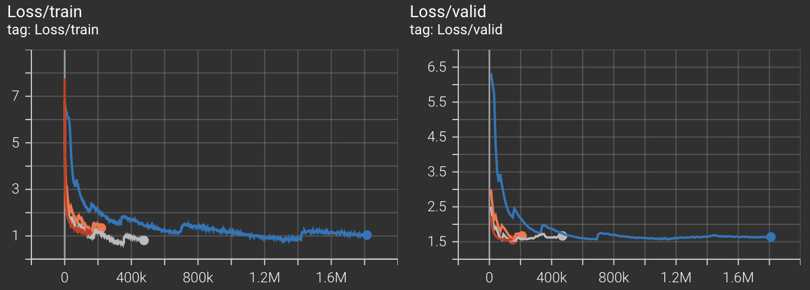

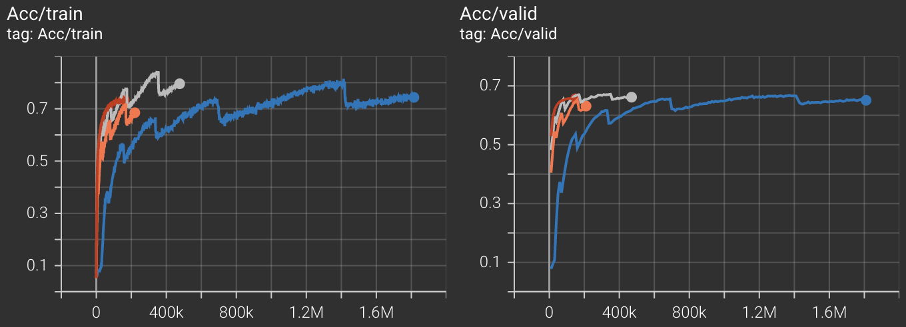

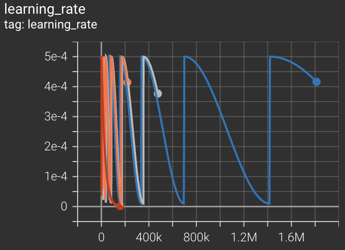

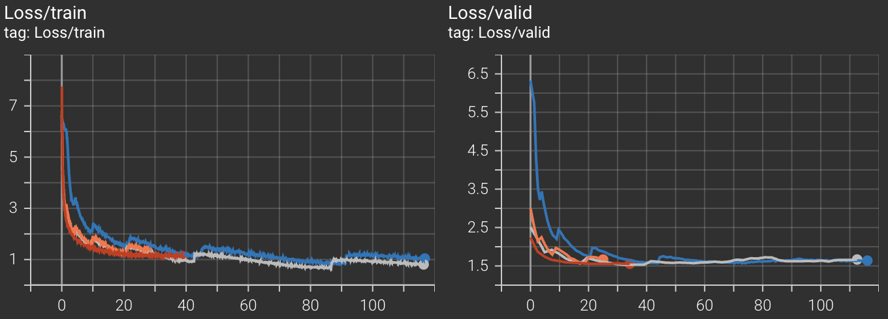

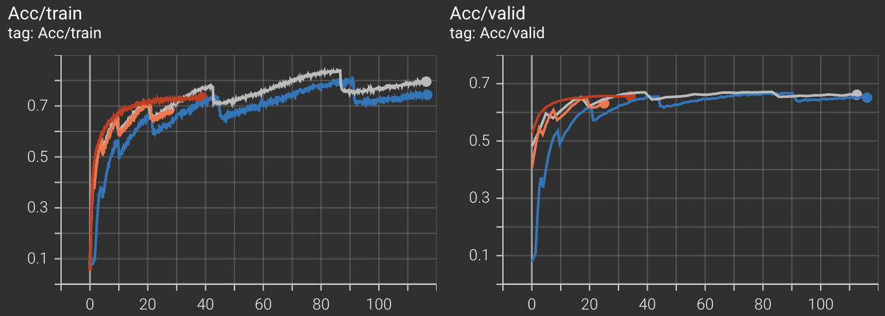

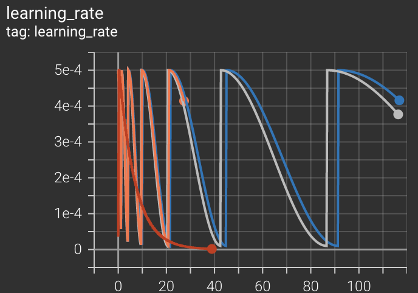
